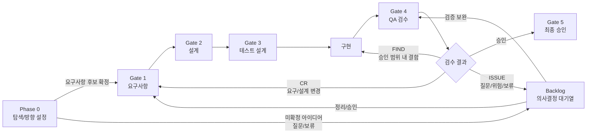

# Vulcan-Anvil Ex

> 사람은 코드를 직접 나열하지 않는다. Orchestrator 에이전트가 요구사항 문서부터 설계, 구현, 테스트, 증적까지 이어서 만든다.

Vulcan-Anvil Ex는 AI 에이전트가 장기 프로젝트에서 길을 잃지 않도록, 문서와 코드와 검증 결과를 하나의 흐름으로 묶는 감리 대응형 개발 프레임워크입니다.

사용자는 "무엇을 만들고 싶은지"를 말하고, 메인 에이전트인 Orchestrator가 요구사항, 설계, 구현, 테스트, 증적 수집을 단계별로 조율합니다. `vulcan.py`는 그 과정에서 LLM이 놓치기 쉬운 ID 체계, Run 기록, 추적성, Gate 전환 규칙을 프로그램으로 점검합니다.

## 한눈에 보기

- **사람/사용자**: 목표, 제약, 승인, 판단이 필요한 결정을 제공한다.
- **Orchestrator**: 사용자와 대화하며 계획을 세우고, 필요한 persona/subagent에 일을 나누고, 결과를 검증한다.
- **문서**: 요구사항, 기능, 화면, 프로그램, DB, 보안, 테스트, 증적을 ID로 연결한다.
- **코드**: 승인된 문서와 추적 규칙을 기준으로 에이전트가 작성한다.
- **검증**: 테스트, 화면 증적, Run 기록, 추적성 검사를 통해 다음 Gate로 넘어갈 수 있는지 확인한다.
- **Adapter**: Codex, Claude 같은 런타임 차이를 흡수한다.
- **Dashboard**: Gate, 문서, Run, 통계, 최근 커밋을 한 화면에서 확인한다.

## Status

**Experimental - v0.2.0**

`0.2.0`은 Codex와 Claude 양쪽 런타임을 모두 실제 프로젝트 생성과 Gate 진행에 사용할 수 있도록 확장한 초기 마이너 버전입니다. Dashboard A2, SW Architecture, DBML ERD, 변경관리/릴리즈 산출물, Build Wave 운영 규칙이 포함되어 있습니다.

아직 제품화된 안정 버전은 아니며, 실제 프로젝트 적용 결과에 따라 문서 체계와 CLI 명령은 계속 조정될 수 있습니다.

릴리즈별 변경사항은 `CHANGELOG.md`를 기준으로 확인합니다.

## 왜 필요한가

AI 에이전트는 코드를 빠르게 만들 수 있지만, 긴 프로젝트에서는 다음 문제가 반복됩니다.

1. 이전 결정과 설계 근거를 잊는다.
2. 구현은 되었지만 요구사항, 테스트, 증적과 연결되지 않는다.
3. QA 중 발견한 결함과 변경요청을 구분하지 못한다.
4. Codex, Claude, GitHub Review처럼 도구가 바뀌면 작업 규칙도 흩어진다.

Vulcan-Anvil Ex는 이 문제를 문서화된 Core 규칙, Adapter, Run 기록, 추적성 검사로 줄이는 것을 목표로 합니다.

## 어떻게 사용하는가

처음 사용하는 사람은 아래 흐름만 이해하면 됩니다.

1. 이 저장소에서 `vulcan.py init`으로 새 프로젝트를 만든다.
2. 생성된 프로젝트 폴더를 Codex CLI, Codex Desktop, Claude 같은 에이전트 환경에서 연다.
3. 사용자는 "로그인이 있는 게시판을 만들고 싶다"처럼 목표와 제약을 말한다.
4. Orchestrator가 `AGENTS.md`와 `docs/core/` 규칙을 읽고 필요한 질문을 한다.
5. Orchestrator가 요구사항, 설계, 테스트 기준, 구현, 증적을 단계별로 만든다.
6. `vulcan.py`는 Run, 추적성, Gate 전환 조건을 검사한다.

즉, 이 도구의 기본 사용 방식은 사람이 명령어를 하나씩 넣어 산출물을 수동 생성하는 것이 아닙니다. 명령어는 Orchestrator가 작업을 기록하고 검증하기 위해 사용하는 보조 장치에 가깝습니다.

## 역할 구분

| 역할 | 하는 일 | 하지 않는 일 |
| --- | --- | --- |
| 사용자 | 만들고 싶은 것, 업무 제약, 승인 여부를 알려준다. | 문서와 코드를 매번 직접 작성하지 않는다. |
| Orchestrator | 대화, 계획, 위임, 검증, 보고를 조율한다. | 검증 없이 subagent 결과를 그대로 확정하지 않는다. |
| Persona/Subagent | 요구사항, 설계, 구현, 리뷰 같은 특정 관점의 작업을 수행한다. | 전체 Gate 판단을 단독으로 끝내지 않는다. |
| `vulcan.py` | 초기화, Run 생성, 추적성 검사, Gate 상태 관리를 수행한다. | LLM처럼 업무 판단을 대신하지 않는다. |

## Phase 0과 5-Gate 흐름

Vulcan-Anvil Ex는 작업을 한 번에 끝내지 않고 Phase 0과 Gate 단위로 나눕니다. 각 Gate는 산출물, 검증, 승인 기준을 가지며, Orchestrator는 현재 단계에 맞는 persona와 Run을 선택합니다.

Phase 0은 아직 무엇을 어떻게 만들지 분명하지 않을 때 쓰는 탐색 단계입니다. 사용자는 정리되지 않은 아이디어, 현행 업무의 불편함, 참고 문서, 대략적인 목표만 말해도 됩니다. Orchestrator는 이 단계에서 질문을 정리하고, 범위와 위험을 나누고, Gate 1로 넘길 수 있는 요구사항 후보를 만듭니다.

| 단계 | 목적 | 주요 산출물 |
| --- | --- | --- |
| Phase 0 | 탐색과 방향 설정 | 목표 초안, 질문 목록, 범위 후보, 제약/위험, 참고자료 목록 |
| Gate 1 | 요구사항 정리 | 요구사항정의서, 요구사항추적표 초안 |
| Gate 2 | 설계 | 기능명세서, 프로그램명세서, 화면설계서, DB명세서, 보안 설계 항목 |
| Gate 3 | 테스트 설계 | 단위/기능 테스트 케이스, 통합 테스트 기준, 성능 테스트 기준 |
| 구현 | 승인된 설계 구현 | 코드, 설정, 메시지 리소스, 테스트 코드 |
| Gate 4 | QA 검수 | 테스트 결과, 화면 증적, FIND/CR/ISSUE 분류 |
| Gate 5 | 최종 승인 | 릴리즈 후보, 인수인계 항목, 잔여 리스크 |

Gate는 사람을 묶어두기 위한 절차가 아니라, 에이전트가 문서와 코드와 검증을 같은 맥락으로 유지하기 위한 작업 기준입니다.



Phase 0은 무거운 절차가 아닙니다. 오히려 "아직 잘 모르겠다"는 상태에서 시작하기 위한 완충 구간입니다. 충분히 작고 명확한 일이면 Phase 0을 짧게 끝내고 바로 Gate 1로 넘어갈 수 있습니다.

Phase 0의 결과가 모두 바로 요구사항이 되는 것은 아닙니다. 확정된 후보는 Gate 1로 넘기고, 아직 판단이 필요한 아이디어나 질문은 Backlog에 남겨 의사결정 후 Gate 1 또는 필요한 Gate를 다시 진행합니다.

`FIND`는 승인된 요구사항과 설계 범위 안의 결함이므로 구현 또는 테스트 보완으로 되돌립니다. `CR`은 요구사항, 설계, 보안 기준선, 데이터 설계, 릴리즈 범위를 바꾸는 변경이므로 필요한 Gate를 `gate-start`로 다시 진행합니다. `ISSUE`는 즉시 결론 내기 어려운 질문, 위험, 보류 항목으로 남겨 의사결정 후 다시 검토합니다.

## Backlog

Backlog는 Gate 밖에 따로 있는 단순 TODO가 아닙니다. Phase 0에서 나온 아이디어, QA에서 발견한 FIND, 요구/설계 변경이 필요한 CR, 판단이 필요한 ISSUE를 다음 Run 또는 필요한 Gate 진행으로 연결하는 대기열입니다.

| 항목 유형 | 의미 | 대표 처리 |
| --- | --- | --- |
| `IDEA` | Phase 0에서 나온 미확정 아이디어나 질문 | 정리 후 Gate 1 후보 |
| `FIND` | 승인 범위 안의 결함이지만 즉시 처리하지 않을 항목 | QA Fix Run 또는 다음 배치 |
| `CR` | 요구사항, 설계, 보안, 데이터, 릴리즈 범위 변경 | 영향도 분석 후 필요한 Gate 진행 |
| `ISSUE` | 결론 내기 어려운 질문, 위험, 보류 사항 | 의사결정 후 FIND/CR/IDEA로 전환 |
| `DEBT` | 기술부채, 리팩터링, 운영 개선 | 우선순위에 따라 Run 생성 |

Orchestrator는 Backlog 항목을 볼 때 우선순위만 보지 않고 관련 ID, 영향 범위, 다시 진행할 Gate, 관련 Run을 함께 확인합니다. `vulcan.py backlog` 명령은 이 대기열을 등록, 조회, 완료, 반려하는 보조 도구입니다.

승인된 CR로 이전 Gate를 다시 진행할 때는 Run 문서를 반드시 작성합니다. 변경 범위는 별도 되돌림 명령으로 관리하지 않고, CR 상세서와 Run 문서의 scope에 기록합니다. 문서와 설계 검토는 scope 중심으로 좁히되, 자동화된 단위테스트는 원칙적으로 전체 실행하고 통합/API/UI 테스트는 영향받는 흐름 중심으로 실행합니다.

## Build Wave

구현 단계는 작업 규모에 따라 운영 강도를 조절합니다. 작은 샘플이나 단일 기능은 하나의 구현 Run으로 진행할 수 있고, 중간 이상 작업이나 subagent/여러 커밋/여러 모듈이 필요한 작업은 `implementation-plan` Run을 만든 뒤 승인된 구현 범위를 여러 `Build Wave`로 나눕니다.

```text
Implementation Plan
→ BW-001 프로젝트 뼈대와 공통 설정
→ BW-002 인증/회원가입/로그인
→ BW-003 TODO 데이터와 CRUD
→ BW-004 UI 상태와 오류/빈 상태
→ BW-005 테스트 결과, 화면 증적, 추적표 정리
```

각 `Build Wave`는 하나의 검증 가능한 구현 배치입니다. Wave가 끝나면 코드, 테스트, 추적표/Run 기록, 검증 결과, 커밋 후보가 함께 남아야 합니다. Wave 단위는 subagent 위임, 커밋, 실패 시 재작업 범위의 기본 단위가 됩니다.

Orchestrator는 동시에 하나의 Wave만 active 상태로 둡니다. 하나의 Wave 안에서는 여러 subagent에게 일을 나눌 수 있지만, 다른 Wave의 코드 수정은 현재 Wave가 완료된 뒤 시작합니다. `Implementation Plan`은 전체 지도이고, Wave별 `build-wave` Run은 subagent에게 전달하는 작업지시서이자 결과보고서입니다.

```powershell
python vulcan.py wave-start BW-001 --title "인증 기반 구현" --related-ids REQ-001-01,PGM-001
python vulcan.py wave-complete BW-001 --status Verified --req REQ-001-01
python vulcan.py sync-session
```

대시보드용 구현 진행률은 `session.json`에 캐시되지만, 원본 판단 근거는 Run 문서, 요구사항추적표, 테스트 결과입니다. 따라서 에이전트는 `session.json`을 직접 편집하지 않고 `vulcan.py` 명령으로 상태를 갱신합니다.

Build Wave를 생략할 수는 있지만, 구현 Run에는 생략 이유, 단일 Run 범위, 관련 ID, 실행할 테스트, 추적표 갱신 기준, 커밋 메시지 후보를 남깁니다.

## 핵심 개념

### Core

`docs/core/`는 런타임과 무관한 공통 규칙입니다.

- `ID_SYSTEM.md`: 요구사항, 설계, 테스트, 증적 ID 체계
- `TRACEABILITY_RULES.md`: 요구사항에서 증적까지의 연결 규칙
- `ORCHESTRATOR_PROTOCOL.md`: 메인 에이전트의 계획, 위임, 검증 규칙
- `AGENT_PERSONAS.md`: 단계별 persona와 subagent 위임 기준
- `AGENT_RUN_PROTOCOL.md`: 에이전트 실행 단위인 Run 규칙
- `CHANGE_CONTROL_PROCESS.md`: FIND, CR, ISSUE, 백로그, 승인된 CR의 Gate 진행 기준
- `REFERENCE_STANDARDS.md`: 보안/데이터 표준 참조 규칙
- `DATA_STANDARD_RULES.md`: 프로젝트 단어사전과 데이터 표준화 규칙

### Orchestrator

Orchestrator는 별도 persona가 아니라 메인 에이전트의 운영 역할입니다.

Orchestrator는 사용자의 요청과 현재 Gate를 보고 다음을 결정합니다.

- 어떤 persona에게 위임할지
- 어떤 Run을 만들지
- 어떤 문서와 코드를 확인할지
- 어떤 검증을 실행할지
- FIND, CR, ISSUE 중 무엇으로 분류할지
- Gate 4에서 별도 handoff를 제안할지

Gate 4에서 `desktop handoff`는 강제하지 않습니다. 화면 검수나 별도 환경 검증이 도움이 될 때 Orchestrator가 사용자에게 제안하고, 사용자가 수락하면 `vulcan.py handoff`로 별도 Run을 만듭니다.

### Adapter

`docs/adapters/`는 런타임별 작업 방식을 담습니다.

- `codex-gpt/`: Codex/GPT용 AGENTS, Run 계약, skill 카드, persona 위임 규칙
- `claude/`: Claude 런타임의 agent/skill 구조와 Core persona 매핑

Codex는 `AGENTS.md`를 진입 문서로 사용하고, Claude는 `CLAUDE.md` 계열 문서를 읽는 구조를 전제로 합니다. Core 규칙은 양쪽 모두에서 공유합니다.

### Run

Run은 에이전트가 수행한 작업 단위입니다.

일반 프로젝트에서는 `docs/runs/`, 샘플처럼 독립 폴더 안에서 관리되는 경우에는 `runs/`에 기록할 수 있습니다. `vulcan.py`는 두 위치를 자동 감지합니다.

Run 문서는 다음을 남깁니다.

- `run_id`
- `adapter`
- `gate`
- `persona`
- `skill`
- `related_ids`
- `verification_results`
- `evidence`
- `traceability_updates`
- `findings`
- `change_requests`
- `open_issues`

## 빠른 시작

### 1. 새 프로젝트 초기화

```powershell
python vulcan.py init ../my-project "My Project"
```

초기화하면 Core 문서, 템플릿, adapter 문서, 공개 표준 참고자료, `AGENTS.md`가 프로젝트에 복사됩니다.

GitHub 같은 원격 저장소와 함께 시작할 때는 `--remote`를 같이 지정합니다.

```powershell
python vulcan.py init ../my-project "My Project" --remote https://github.com/julyinsung/my-project.git
```

`--remote`를 사용하면 생성된 프로젝트에 `origin` remote를 등록하고 초기 커밋을 원격 저장소로 push합니다. 단, 원격 저장소가 아직 없거나 권한 문제가 있으면 로컬 초기 커밋까지만 완료하고 경고를 출력합니다. 대시보드에서 GitHub 주소를 기준으로 프로젝트를 등록하거나, 다른 환경에서 같은 프로젝트를 이어서 작업할 때 이 방식이 좋습니다.

원격 저장소 등록과 push가 반드시 성공해야 하는 프로젝트라면 `--require-remote`를 함께 사용합니다.

```powershell
python vulcan.py init ../my-project "My Project" --remote https://github.com/julyinsung/my-project.git --require-remote
```

`--require-remote`가 있으면 remote 등록 또는 push에 실패했을 때 초기화를 실패로 처리합니다. 원격 저장소가 아직 없거나 권한 문제가 있을 수 있으므로, 보통은 GitHub에서 빈 저장소를 먼저 만든 뒤 URL을 넣습니다.

### 2. 프로젝트에서 작업

```powershell
cd ../my-project
```

이후에는 선택한 에이전트 환경에서 프로젝트를 엽니다.

- Codex CLI: 프로젝트 폴더에서 Codex를 실행한다.
- Codex Desktop: 프로젝트 폴더를 열고 대화를 시작한다.
- Claude: Claude 런타임에서 프로젝트 폴더와 adapter 문서를 기준으로 작업한다.

처음에는 가볍게 인사하거나 목표를 말하면 됩니다. Orchestrator는 먼저 자신이 요구사항, 설계, 구현, 테스트, 증적을 Gate별로 조율하는 역할임을 짧게 안내하고, 현재 Phase 0에서 필요한 입력을 물어봅니다.

사용자는 다음처럼 시작하면 됩니다.

> 로그인과 게시글 작성 기능이 있는 게시판 샘플을 만들고 싶어. 감리 대응 문서와 테스트 증적까지 같이 만들어줘.

그러면 Orchestrator는 `AGENTS.md`, `docs/core/`, adapter 규칙을 읽고 필요한 질문을 한 뒤, 현재 Gate에서 허용된 범위부터 단계별로 진행합니다. Phase 0 또는 Gate 1에서는 바로 구현하지 않고 범위, 요구사항, 질문, 승인 지점을 먼저 정리합니다.

## CLI 참고

아래 명령어는 사람이 매번 직접 실행해야 하는 절차라기보다, Orchestrator가 작업을 기록하고 검증할 때 사용하는 도구입니다. 필요하면 사용자가 직접 실행할 수도 있습니다.

### Orchestrator 계획 생성

```powershell
python vulcan.py orchestrator-plan ^
  --goal "로그인 게시판 Gate 4 검수 계획" ^
  --gate gate4 ^
  --persona review ^
  --related-ids REQ-001,UI-001
```

### Run 생성

```powershell
python vulcan.py run-new ^
  --gate gate4 ^
  --persona review ^
  --skill traceability-review ^
  --title "로그인 게시판 추적성 검토" ^
  --related-ids REQ-001,REQ-002
```

### Run 검사

```powershell
python vulcan.py run-check docs/runs/RUN-001_login-traceability_v0.1.md
```

### Gate 추적성 검사

```powershell
python vulcan.py check-trace
```

## 주요 명령

| 명령 | 설명 |
| --- | --- |
| `init` | 새 프로젝트에 Vulcan-Anvil Ex 문서와 템플릿을 주입 |
| `orchestrator-plan` | Orchestrator 실행 계획 Run 생성 |
| `run-new` | persona/skill 기반 Run 초안 생성 |
| `run-check` | Run 문서 필수 필드와 상태 검사 |
| `handoff` | 다른 실행 환경으로 넘길 검수 Run 생성 |
| `check-trace` | Gate별 추적성 검사 |
| `backlog` | 백로그 추가, 조회, 완료, 반려 |
| `export` | 대시보드용 snapshot 생성 |
| `upgrade` | 기존 프로젝트에 최신 framework 문서 반영 |
| `version` | 현재 Vulcan-Anvil Ex 버전 확인 |

## 생성되는 주요 구조

```text
my-project/
├── AGENTS.md
├── session.json
├── vulcan.py
└── docs/
    ├── core/
    ├── templates/
    ├── adapters/
    ├── seed-docs/
    ├── ref-docs/
    ├── backlog/
    └── runs/
```

`docs/ref-docs/`는 민감한 프로젝트 참고문서를 둘 수 있는 영역이며 기본적으로 Git에서 제외됩니다.

`docs/seed-docs/`는 공개 표준 문서를 프로젝트에 주입하는 영역입니다. 현재는 공공데이터 공통표준과 소프트웨어 개발보안 관련 공개 문서를 기준 자료로 둡니다.

`docs/backlog/DOC-PM-OPS-001_Backlog_v0.1.md`는 Phase 0 아이디어, FIND, CR, ISSUE, 기술부채를 다음 Run 또는 필요한 Gate 진행으로 연결하는 백로그 산출문서입니다.

## 문서 템플릿

`docs/templates/`에는 다음 산출물 템플릿이 있습니다.

- 요구사항정의서
- 요구사항추적표
- 기능명세서
- 프로그램명세서
- 화면설계서
- DB명세서
- 개발표준서
- 테스트케이스
- QA Finding
- 변경요청
- 프로젝트 단어사전

템플릿은 Markdown으로 관리하지만, 향후 감리 제출용으로 Excel, Word, HWPX 등 일반 문서 형식으로 변환하는 흐름을 붙일 수 있도록 설계합니다.

작업용 Markdown 산출물과 제출용 DOCX/XLSX/HWPX 합본 문서의 관계는 `docs/reference/SUBMISSION-DOCUMENT-STRATEGY.md`를 기준으로 합니다. 원칙은 작업 중에는 원천 문서를 나누어 관리하고, 제출 시점에는 DOCX 템플릿과 생성 코드를 통해 필요한 내용을 합성하는 방식입니다.

## 샘플 프로젝트

`docs/examples/board-with-login/`에는 로그인 기능이 있는 게시판 샘플이 들어 있습니다.

샘플에는 다음이 포함됩니다.

- 요구사항, 기능, 프로그램, 화면, DB, 테스트, UI 증적 문서
- FastAPI 기반 샘플 앱
- 단위/통합/UI 라우트 테스트
- Orchestrator 기반 Gate 4 검수 Run 예시

검증 예시:

```powershell
cd docs/examples/board-with-login/sample-app
python -m pytest -p no:cacheprovider tests
```

## 보안과 데이터 표준

설계와 구현 단계에서는 다음을 함께 봅니다.

- 소프트웨어 개발보안 가이드
- 소프트웨어 보안약점 진단가이드
- 공공데이터 공통표준
- 프로젝트 단어사전

보안 항목은 `SEC-ID`로 요구사항, 프로그램, 화면, 테스트와 연결합니다. 데이터 항목은 공공데이터 공통표준을 먼저 확인하고, 없으면 프로젝트 단어사전에 추가하는 흐름을 기본으로 합니다.

## 세션 협업 모델

세션 간 실시간 통신은 Core 전제 조건이 아닙니다.

대신 다음 파일을 공유 상태로 사용합니다.

- `session.json`
- `docs/runs/`
- 향후 `docs/reviews/`
- 증적 파일
- 백로그 문서

이상적인 세션 협업 모델은 `docs/reference/SESSION-COORDINATION-IDEAL.md`에 정리되어 있습니다. 실시간 브로드캐스트나 watcher는 향후 확장 옵션입니다.

## 현재 방향

`0.2.0` 이후의 다음 초점은 다음입니다.

- 실제 SI형 다중 프로젝트 구조 검토
- 감리 제출용 DOCX/XLSX/HWPX 변환 흐름 설계
- Dashboard A2의 반응형 밀도와 검수 화면 개선
- Codex/Claude adapter의 실제 Run 결과 비교와 규칙 보강
- Review Queue 또는 별도 reviewer 프로세스 도입 여부 판단

## 주의

이 프로젝트는 아직 실험적입니다. 모든 프로젝트에 맞는 무거운 프로세스를 강제하려는 도구가 아니라, 감리와 장기 유지보수가 필요한 프로젝트에서 AI 에이전트가 길을 잃지 않게 만드는 작업대에 가깝습니다.
