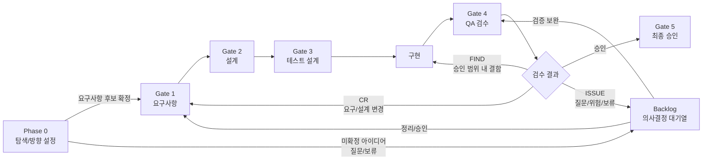
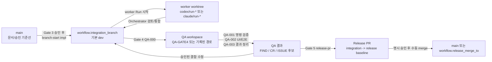

# Concepts

이 문서는 Vulcan-Anvil Ex를 이해하기 위한 핵심 개념을 설명합니다.

## 이름의 의미

**Vulcan**은 불과 대장장이의 신에서 가져온 이름입니다. 여기서는 AI 에이전트가 요구사항, 설계, 코드, 테스트를 실제 작업 결과로 만들어가는 실행력을 뜻합니다.

**Anvil**은 모루입니다. 금속을 올려놓고 형태를 잡는 작업대처럼, 이 프로젝트에서는 문서, Gate, Run, 추적성, 검증 규칙이 에이전트 작업을 받쳐주는 기반을 뜻합니다.

**Ex**는 Extended를 뜻합니다. 기존 Vulcan-Anvil의 5-Gate 흐름을 바탕으로 Codex와 Claude 같은 여러 에이전트 런타임, Dashboard, Build Wave, 변경관리, 제출용 문서 전략, Delivery Profile까지 확장한 버전입니다.

## 역할 구분

| 역할 | 하는 일 | 하지 않는 일 |
| --- | --- | --- |
| 사용자 | 만들고 싶은 것, 업무 제약, 승인 여부를 알려준다. | 문서와 코드를 매번 직접 작성하지 않는다. |
| Orchestrator | 대화, 계획, 위임, 검증, 보고를 조율한다. | 검증 없이 subagent 결과를 그대로 확정하지 않는다. |
| Persona/Subagent | 요구사항, 설계, 구현, 리뷰 같은 특정 관점의 작업을 수행한다. | 전체 Gate 판단을 단독으로 끝내지 않는다. |
| `vulcan.py` | 초기화, Run 생성, 추적성 검사, Gate 상태 관리를 수행한다. | LLM처럼 업무 판단을 대신하지 않는다. |

## Phase 0과 5-Gate 흐름

Vulcan-Anvil Ex는 작업을 한 번에 끝내지 않고 Phase 0과 Gate 단위로 나눕니다. 각 Gate는 산출물, 검증, 승인 기준을 가지며, Orchestrator는 현재 단계에 맞는 persona와 Run을 선택합니다.

Phase 0은 아직 무엇을 어떻게 만들지 분명하지 않을 때 쓰는 탐색 단계입니다. 사용자는 정리되지 않은 아이디어, 현행 업무의 불편함, 참고 문서, 대략적인 목표만 말해도 됩니다.

| 단계 | 목적 | 주요 산출물 |
| --- | --- | --- |
| Phase 0 | 탐색과 방향 설정 | 목표 초안, 질문 목록, 범위 후보, 제약/위험, 참고자료 목록 |
| Gate 1 | 요구사항 정리 | 요구사항정의서, 요구사항추적표 초안 |
| Gate 2 | 설계 | 아키텍처, 기능명세서, 프로그램 설계서, API정의서, 화면설계서, DB명세서, 보안가이드 |
| Gate 3 | 테스트 설계 | 단위/기능 테스트 케이스, 통합 테스트 기준, 성능 테스트 기준 |
| 구현 | 승인된 설계 구현 | 코드, 설정, 메시지 리소스, 테스트 코드 |
| Gate 4 | QA 검수 | 테스트 결과, 화면 증적, FIND/CR/ISSUE 분류 |
| Gate 5 | 최종 승인 | 릴리즈 후보, 인수인계 항목, 잔여 리스크 |



Gate는 사람을 묶어두기 위한 절차가 아니라, 에이전트가 문서와 코드와 검증을 같은 맥락으로 유지하기 위한 작업 기준입니다.

## Branch Workflow

Audit profile은 문서 기준선과 구현 통합선을 분리합니다. 브랜치 이름 자체를 강제하지는 않지만, 구현과 QA의 기준이 되는 통합 브랜치 역할은 반드시 있어야 합니다.

| 역할 | 기본 이름 | 의미 |
| --- | --- | --- |
| 기준 브랜치 | `main` | `init`, Phase 0, Gate 1, Gate 2, Gate 3 산출물과 사용자 승인 기준선 |
| 통합 브랜치 | `workflow.integration_branch`, 기본 `dev` | `impl`에서 worker 결과를 통합하고 Gate 4 QA 후보를 모으는 브랜치 |
| worker worktree | `codex/run-*`, `claude/run-*` 등 | 개별 Run을 격리해 수행하는 임시 작업공간 |
| QA workspace | `QA-000`이 기록한 workspace/worktree | Gate 4의 `QA-001`~`QA-003`이 재사용하는 검증 공간 |

`dev`는 기본값일 뿐입니다. 프로젝트/팀이 원하면 `vulcan.config.json`에서 `workflow.integration_branch`를 `develop`, `dev-happy`, `integration/*` 같은 이름으로 바꿀 수 있습니다.



대시보드는 현재 폴더가 어떤 브랜치를 checkout하고 있는지와 설정된 `workflow.integration_branch`를 보여주는 관찰 화면입니다. 실제 규약 위반 여부와 브랜치 전환은 `vulcan.py branch-status`, `branch-start impl`, `wave-start`, `run-exec` guard가 담당합니다.

Gate 5에서는 `python vulcan.py release-pr`로 통합 브랜치에서 기준 브랜치로 가는 Release PR을 만들 수 있습니다.
Release PR은 릴리즈 후보를 검토하기 위한 단위이며, runner 결과만으로 자동 merge하지 않습니다.
merge는 사용자 명시 승인 또는 프로젝트의 Gate 5 승인 절차 뒤에 수행합니다.

## Backlog

Backlog는 Gate 밖에 따로 있는 단순 TODO가 아닙니다. Phase 0에서 나온 아이디어, QA에서 발견한 FIND, 요구/설계 변경이 필요한 CR, 판단이 필요한 ISSUE를 다음 Run 또는 필요한 Gate 진행으로 연결하는 대기열입니다.

| 항목 유형 | 의미 | 대표 처리 |
| --- | --- | --- |
| `IDEA` | Phase 0에서 나온 미확정 아이디어나 질문 | 정리 후 Gate 1 후보 |
| `FIND` | 승인 범위 안의 결함이지만 즉시 처리하지 않을 항목 | QA Fix Run 또는 다음 배치 |
| `CR` | 요구사항, 설계, 보안, 데이터, 릴리즈 범위 변경 | 영향도 분석 후 필요한 Gate 진행 |
| `ISSUE` | 결론 내기 어려운 질문, 위험, 보류 사항 | 의사결정 후 FIND/CR/IDEA로 전환 |
| `DEBT` | 기술부채, 리팩터링, 운영 개선 | 우선순위에 따라 Run 생성 |

승인된 CR로 이전 Gate를 다시 진행할 때는 Run 문서를 반드시 작성합니다. 변경 범위는 CR 상세서와 Run 문서의 scope에 기록합니다.

## Build Wave

구현 단계는 작업 규모에 따라 운영 강도를 조절합니다. 작은 샘플이나 단일 기능은 하나의 worker Run으로 진행할 수 있고, 중간 이상 작업이나 subagent/여러 커밋/여러 모듈이 필요한 작업은 `implementation-plan` Run을 만든 뒤 승인된 구현 범위를 여러 `Build Wave`로 나눕니다. 이때 Wave 분할 생략은 Orchestrator 직접 구현을 의미하지 않습니다. 실제 코드/테스트/UI/API 구현은 기본적으로 `build` persona, subagent, 또는 `agent-run --mode work` worker가 수행합니다.

구현에 들어가면 먼저 `python vulcan.py branch-start impl`로 `workflow.integration_branch`를 만들거나 전환합니다. 신규 개발처럼 빌드 가능한 골격이 없으면 feature 구현 Wave 전에 `BW-000 implementation-scaffold`를 두어 package/build/test skeleton과 public class/interface/method signature를 먼저 고정합니다.

```text
Implementation Plan
→ BW-000 구현 scaffold와 빌드 가능한 골격
→ BW-001 인증/회원가입/로그인
→ BW-002 TODO 데이터와 CRUD
→ BW-003 UI 상태와 오류/빈 상태
→ Gate 4 QA-000~QA-003 테스트 실행과 증적 정리
```

각 `Build Wave`는 하나의 검증 가능한 구현 배치입니다. Wave가 끝나면 코드, 테스트, 추적표/Run 기록, 검증 결과, 커밋 후보가 함께 남아야 합니다.

```powershell
python vulcan.py wave-start BW-001 --title "인증 기반 구현" --related-ids REQ-001-01,PGM-001
python vulcan.py wave-complete BW-001 --status Verified --req REQ-001-01
python vulcan.py sync-session
```

대시보드용 구현 진행률은 `session.json`에 캐시되지만, 원본 판단 근거는 Run 문서, 요구사항추적표, 테스트 결과입니다.

## Core

`docs/core/`는 런타임과 무관한 공통 규칙입니다.

- `ID_SYSTEM.md`: 요구사항, 설계, 테스트, 증적 ID 체계
- `TRACEABILITY_RULES.md`: 요구사항에서 증적까지의 연결 규칙
- `ORCHESTRATOR_PROTOCOL.md`: 메인 에이전트의 계획, 위임, 검증 규칙
- `AGENT_PERSONAS.md`: 단계별 persona와 subagent 위임 기준
- `AGENT_RUN_PROTOCOL.md`: 에이전트 실행 단위인 Run 규칙
- `CHANGE_CONTROL_PROCESS.md`: FIND, CR, ISSUE, 백로그, 승인된 CR의 Gate 진행 기준
- `REFERENCE_STANDARDS.md`: 보안/데이터 표준 참조 규칙
- `DATA_STANDARD_RULES.md`: 프로젝트 단어사전과 데이터 표준화 규칙

## Adapter

`docs/adapters/`는 런타임별 작업 방식을 담습니다.

- `codex-gpt/`: Codex/GPT용 AGENTS, Run 계약, skill 카드, persona 위임 규칙
- `claude/`: Claude 런타임의 agent/skill 구조와 Core persona 매핑

Codex는 `AGENTS.md`를 진입 문서로 사용하고, Claude는 `CLAUDE.md` 계열 문서를 읽는 구조를 전제로 합니다. Core 규칙은 양쪽 모두에서 공유합니다.

## Run

Run은 에이전트가 수행한 작업 단위입니다.

Run 문서는 다음을 남깁니다.

- `run_id`
- `adapter`
- `gate`
- `persona`
- `skill`
- `related_ids`
- `verification_results`
- `evidence`
- `traceability_updates`
- `findings`
- `change_requests`
- `open_issues`
