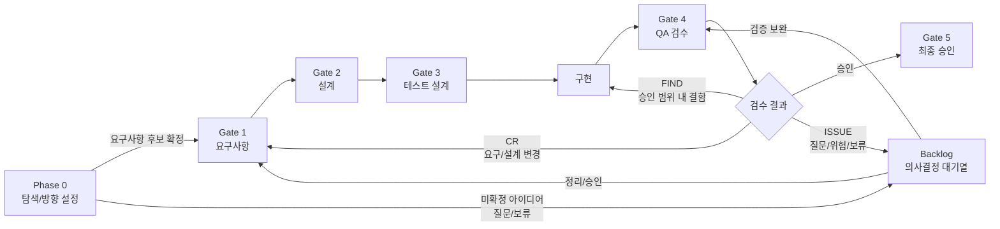
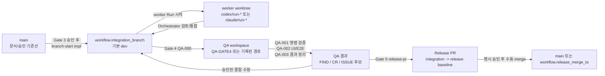

# Concepts

이 문서는 Vulcan-Anvil Ex를 이해하기 위한 핵심 개념을 설명합니다.

## 이름의 의미

**Vulcan**은 불과 대장장이의 신에서 가져온 이름입니다. 여기서는 AI 에이전트가 요구사항, 설계, 코드, 테스트를 실제 작업 결과로 만들어가는 실행력을 뜻합니다.

**Anvil**은 모루입니다. 금속을 올려놓고 형태를 잡는 작업대처럼, 이 프로젝트에서는 문서, Gate, Run, 추적성, 검증 규칙이 에이전트 작업을 받쳐주는 기반을 뜻합니다.

**Ex**는 Extended를 뜻합니다. 기존 Vulcan-Anvil의 5-Gate 흐름을 바탕으로 Codex와 Claude 같은 여러 에이전트 런타임, Dashboard, Build Wave, 변경관리, 제출용 문서 전략, Delivery Profile까지 확장한 버전입니다.

## 역할 구분

| 역할 | 하는 일 | 하지 않는 일 |
| --- | --- | --- |
| 사용자 | 만들고 싶은 것, 업무 제약, 승인 여부를 알려준다. | 문서와 코드를 매번 직접 작성하지 않는다. |
| Orchestrator | 대화, 계획, 위임, 검증, 보고를 조율한다. | 검증 없이 subagent 결과를 그대로 확정하지 않는다. |
| Persona/Subagent | 요구사항, 설계, 구현, 리뷰 같은 특정 관점의 작업을 수행한다. | 전체 Gate 판단을 단독으로 끝내지 않는다. |
| `vulcan.py` | 초기화, Run 생성, 추적성 검사, Gate 상태 관리를 수행한다. | LLM처럼 업무 판단을 대신하지 않는다. |

## Phase 0과 5-Gate 흐름

Vulcan-Anvil Ex는 작업을 한 번에 끝내지 않고 Phase 0과 Gate 단위로 나눕니다. 각 Gate는 산출물, 검증, 승인 기준을 가지며, Orchestrator는 현재 단계에 맞는 persona와 Run을 선택합니다.

Phase 0은 아직 무엇을 어떻게 만들지 분명하지 않을 때 쓰는 탐색 단계입니다. 사용자는 정리되지 않은 아이디어, 현행 업무의 불편함, 참고 문서, 대략적인 목표만 말해도 됩니다.

| 단계 | 목적 | 주요 산출물 |
| --- | --- | --- |
| Phase 0 | 탐색과 방향 설정 | 목표 초안, 질문 목록, 범위 후보, 제약/위험, 참고자료 목록 |
| Gate 1 | 요구사항 정리 | 요구사항정의서, 요구사항추적표 초안 |
| Gate 2 | 설계 | 아키텍처, 기능명세서, 프로그램 설계서, API정의서, 화면설계서, DB명세서, 보안가이드 |
| Gate 3 | 테스트 설계 | 단위/기능 테스트 케이스, 통합 테스트 기준, 성능 테스트 기준 |
| 구현 | 승인된 설계 구현 | 코드, 설정, 메시지 리소스, 테스트 코드 |
| Gate 4 | QA 검수 | 테스트 결과, 화면 증적, FIND/CR/ISSUE 분류 |
| Gate 5 | 최종 승인 | 릴리즈 후보, 인수인계 항목, 잔여 리스크 |

Gate 3 테스트케이스는 테스트 계획과 기대 기준을 정의합니다. Gate 4 테스트 결과서는 실제 실행 결과의 원본이고, 요구사항추적표는 요구사항별 최종 검증 상태를 요약하는 원장입니다.


```mermaid
flowchart LR
  P0["Phase 0<br/>탐색/방향 설정"] -->|"요구사항 후보 확정"| G1["Gate 1<br/>요구사항"]
  P0 -->|"미확정 아이디어<br/>질문/보류"| Q["Backlog<br/>의사결정 대기열"]
  Q -->|"정리/승인"| G1
  G1 --> G2["Gate 2<br/>설계"]
  G2 --> G3["Gate 3<br/>테스트 설계"]
  G3 --> B["구현"]
  B --> G4["Gate 4<br/>QA 검수"]
  G4 --> D{"검수 결과"}
  D -->|"승인"| G5["Gate 5<br/>최종 승인"]
  D -->|"FIND<br/>승인 범위 내 결함"| B
  D -->|"CR<br/>요구/설계 변경"| G1
  D -->|"ISSUE<br/>질문/위험/보류"| Q
  Q -->|"검증 보완"| G4
```

Gate는 사람을 묶어두기 위한 절차가 아니라, 에이전트가 문서와 코드와 검증을 같은 맥락으로 유지하기 위한 작업 기준입니다.

## Branch Workflow

Audit profile은 문서 기준선과 구현 통합선을 분리합니다. 브랜치 이름 자체를 강제하지는 않지만, 구현과 QA의 기준이 되는 통합 브랜치 역할은 반드시 있어야 합니다.

| 역할 | 기본 이름 | 의미 |
| --- | --- | --- |
| 기준 브랜치 | `main` | `init`, Phase 0, Gate 1, Gate 2, Gate 3 산출물과 사용자 승인 기준선 |
| 통합 브랜치 | `workflow.integration_branch`, 기본 `dev` | `impl`에서 worker 결과를 통합하고 Gate 4 QA 후보를 모으는 브랜치 |
| worker worktree | `codex/run-*`, `claude/run-*` 등 | 개별 Run을 격리해 수행하는 임시 작업공간 |
| QA workspace | `QA-000`이 기록한 integration branch 작업공간 | Gate 4의 `QA-001`~`QA-003`이 재사용하는 검증 공간. QA worktree는 명시적으로 활성화한 경우만 사용 |

`dev`는 기본값일 뿐입니다. 프로젝트/팀이 원하면 `vulcan.config.json`에서 `workflow.integration_branch`를 `develop`, `dev-happy`, `integration/*` 같은 이름으로 바꿀 수 있습니다.


```mermaid
flowchart LR
  Main["main<br/>문서/승인 기준선"] -->|"Gate 3 승인 후<br/>branch-start impl"| Integration["workflow.integration_branch<br/>기본 dev"]
  Integration -->|"worker Run 시작"| Worker["worker worktree<br/>codex/run-* 또는 claude/run-*"]
  Worker -->|"Orchestrator 검토/통합"| Integration
  Integration -->|"Gate 4 QA-000"| QA["QA workspace<br/>QA-GATE4 또는 기록된 경로"]
  QA -->|"QA-001 명령 검증<br/>QA-002 UI/E2E<br/>QA-003 결과 정리"| QAResult["QA 결과<br/>FIND / CR / ISSUE 후보"]
  QAResult -->|"승인된 결함 수정"| Integration
  QAResult -->|"Gate 5 release-pr"| PR["Release PR<br/>integration -> release baseline"]
  PR -->|"명시 승인 후 수동 merge"| Release["main 또는 workflow.release_merge_to"]
```

대시보드는 현재 폴더가 어떤 브랜치를 checkout하고 있는지와 설정된 `workflow.integration_branch`를 보여주는 관찰 화면입니다. 실제 규약 위반 여부와 브랜치 전환은 `vulcan.py status`, 필요 시 `branch-status`, `branch-start impl`, `wave-start`, `run-exec` guard가 담당합니다.

Gate 5에서는 `python vulcan.py release-pr`로 통합 브랜치에서 기준 브랜치로 가는 Release PR을 만들 수 있습니다.
Release PR은 릴리즈 후보를 검토하기 위한 단위이며, runner 결과만으로 자동 merge하지 않습니다.
`release-pr --dry-run`도 동일한 PR body를 `.vulcan/release/release-pr-body.md`에 만들며, 현재 브랜치가 통합 브랜치인지, base/head 브랜치가 존재하는지, 미커밋 변경이 없는지 먼저 확인합니다.
merge는 사용자 명시 승인 또는 프로젝트의 Gate 5 승인 절차 뒤에 수행합니다.

## Gate Transition Readiness

Gate 산출물이 작성되었다고 해서 다음 Gate로 자동 진행하지 않습니다. `status --check`는 다음 Gate로 넘어가기 전에 Run 완료 상태, 추적성 정합성, 차단 이슈를 한 번에 확인하는 기본 사전 진단입니다.

```powershell
python vulcan.py status --check
```

이 명령은 승인 판단을 대신하지 않습니다. Orchestrator가 결과를 해석하고, 실패한 산출물/ID/Run을 정리한 뒤 사용자에게 다음 Gate 진행 여부를 묻기 위한 준비 단계입니다. `prepare-transition`은 같은 진단의 상세/호환 명령으로 남깁니다.

## Drift Report

구현 결과가 설계와 다를 때 곧바로 설계 문서를 코드 기준으로 덮어쓰면 "구현이 설계를 지배하는" 문제가 생깁니다. Ex는 이 상황을 먼저 drift 후보로 분리합니다.

```powershell
python vulcan.py drift-report --output docs/artifacts/04-review/evidence/contract/contract-drift-report.md
```

`drift-report`는 설계 산출물과 실제 코드/API/DB surface 사이의 불일치를 보고합니다. 결과는 FIND, CR, ISSUE 후보이며, 승인된 경우에만 설계 문서 또는 코드를 별도 Run으로 수정합니다.

## Backlog

Backlog는 Gate 밖에 따로 있는 단순 TODO가 아닙니다. Phase 0에서 나온 아이디어, QA에서 발견한 FIND, 요구/설계 변경이 필요한 CR, 판단이 필요한 ISSUE를 다음 Run 또는 필요한 Gate 진행으로 연결하는 대기열입니다.

| 항목 유형 | 의미 | 대표 처리 |
| --- | --- | --- |
| `IDEA` | Phase 0에서 나온 미확정 아이디어나 질문 | 정리 후 Gate 1 후보 |
| `FIND` | 승인 범위 안의 결함이지만 즉시 처리하지 않을 항목 | QA Fix Run 또는 다음 배치 |
| `CR` | 요구사항, 설계, 보안, 데이터, 릴리즈 범위 변경 | 영향도 분석 후 필요한 Gate 진행 |
| `ISSUE` | 결론 내기 어려운 질문, 위험, 보류 사항 | 의사결정 후 FIND/CR/IDEA로 전환 |
| `DEBT` | 기술부채, 리팩터링, 운영 개선 | 우선순위에 따라 Run 생성 |

승인된 CR로 이전 Gate를 다시 진행할 때는 Run 문서를 반드시 작성합니다. 변경 범위는 CR 상세서와 Run 문서의 scope에 기록합니다.

## Build Wave

구현 단계는 작업 규모에 따라 운영 강도를 조절합니다. 작은 샘플이나 단일 기능은 하나의 worker Run으로 진행할 수 있고, 중간 이상 작업이나 subagent/thread/여러 커밋/여러 모듈이 필요한 작업은 `implementation-plan` Run을 만든 뒤 승인된 구현 범위를 여러 `Build Wave`로 나눕니다. 이때 Wave 분할 생략은 Orchestrator 직접 구현을 의미하지 않습니다. 실제 코드/테스트/UI/API 구현은 기본적으로 `build` persona의 native worker(subagent/thread/native branch agent)가 수행합니다.

`agent-run`/`run-exec`는 기본 구현 경로가 아니라 외부 CLI runner가 필요할 때 쓰는 선택 옵션입니다.

위임 기록은 실행 방식에 따라 두께가 다릅니다. 외부 CLI worker는 `Run Execution Record`, `_exec` 로그, timeout/watchdog, worktree/branch 정보를 남깁니다. Codex subagent/thread, Claude subagent, Agy workspace branch agent 같은 native 위임은 같은 프로세스 메타가 없을 수 있으므로 현재 Run의 `delegation_records`에 위임 대상, 범위, 변경 파일, 결과 요약, Orchestrator 재검증 명령을 남깁니다.

Agy의 `Workspace: branch`는 Antigravity runtime이 제공하는 native branch agent 경로로 다룹니다. 일반 Git worktree와 달리 Copy-on-Write/가상 오버레이로 의존성 폴더를 재사용할 수 있다는 장점이 있지만, 이는 Agy runtime 특화 기능이므로 Core의 범용 실행 전제로 삼지 않습니다. Agy native branch 결과는 `delegation_records.mode: agy-branch-agent`로 기록하고, 외부 `agy.exe` runner의 transcript/watchdog 기록이 필요할 때만 `agent-run`/`run-exec` 경로를 선택합니다. Agy native 위임은 `run-exec` 자동 preflight 경로를 타지 않으므로 Orchestrator가 worker 호출 전에 `python vulcan.py run-preflight <run-file>`를 직접 실행해야 합니다. 검토 기록은 [Agy Workspace Branch Delegation Review](reference/_reviews/AGY-WORKSPACE-BRANCH-DELEGATION-REVIEW.md)에 남겨둡니다.

구현에 들어가면 먼저 `python vulcan.py branch-start impl`로 `workflow.integration_branch`를 만들거나 전환합니다. 신규 개발처럼 빌드 가능한 골격이 없으면 feature 구현 Wave 전에 `BW-000 implementation-scaffold`를 두어 package/build/test skeleton과 public class/interface/method signature를 먼저 고정합니다.

```text
Implementation Plan
→ BW-000 구현 scaffold와 빌드 가능한 골격
→ BW-001 인증/회원가입/로그인
→ BW-002 TODO 데이터와 CRUD
→ BW-003 UI 상태와 오류/빈 상태
→ Gate 4 QA-000~QA-003 테스트 실행과 증적 정리
```

각 `Build Wave`는 하나의 검증 가능한 구현 배치입니다. Wave가 끝나면 코드, 테스트, 추적표/Run 기록, 검증 결과, 커밋 후보가 함께 남아야 합니다.

```powershell
python vulcan.py wave-start BW-001 --title "인증 기반 구현" --related-ids REQ-001-01,PGM-001
python vulcan.py wave-complete BW-001 --status Verified --req REQ-001-01
python vulcan.py sync-session
```

대시보드용 구현 진행률은 `session.json`에 캐시되지만, 원본 판단 근거는 Run 문서, 요구사항추적표, 테스트 결과입니다.

## Core

`docs/core/`는 런타임과 무관한 공통 규칙입니다.

- `ID_SYSTEM.md`: 요구사항, 설계, 테스트, 증적 ID 체계
- `TRACEABILITY_RULES.md`: 요구사항에서 증적까지의 연결 규칙
- `ORCHESTRATOR_PROTOCOL.md`: 메인 에이전트의 계획, 위임, 검증 규칙
- `GATE_EXECUTION_CHECKLIST.md`: 모든 runner가 공통으로 따르는 Gate 실행/승인/위임 경계
- `AGENT_PERSONAS.md`: 단계별 persona와 subagent 위임 기준
- `AGENT_RUN_PROTOCOL.md`: 에이전트 실행 단위인 Run 규칙
- `CHANGE_CONTROL_PROCESS.md`: FIND, CR, ISSUE, 백로그, 승인된 CR의 Gate 진행 기준
- `REFERENCE_STANDARDS.md`: 보안/데이터 표준 참조 규칙
- `DATA_STANDARD_RULES.md`: 프로젝트 단어사전과 데이터 표준화 규칙

## Adapter

`docs/adapters/`는 런타임별 작업 방식을 담습니다.

- `codex-gpt/`: Codex/GPT용 AGENTS, Run 계약, skill 카드, persona 위임 규칙
- `claude/`: Claude 런타임의 agent/skill 구조와 Core persona 매핑
- `gemini/`: Gemini/Antigravity 런타임의 구조화 Gate prompt, 한계, persona 매핑, Agy native subagent/Workspace branch 위임 기준

Codex는 `AGENTS.md`를 진입 문서로 사용하고, Claude는 `CLAUDE.md` 계열 문서를 읽는 구조를 전제로 합니다. Core 규칙은 모든 runner가 공유합니다. 다만 Run 입력의 `source_documents.read_first`에는 runner별 prompt를 섞지 않습니다. Codex Run은 Codex adapter prompt, Claude Run은 Claude adapter prompt, Gemini/Antigravity Run은 Gemini adapter prompt를 추가로 받습니다.

Antigravity/Agy를 메인 Orchestrator로 사용할 때는 `GEMINI.md`와 `docs/adapters/gemini/`가 진입 기준이 됩니다. Agy 플랫폼 도구가 native subagent와 `Workspace: branch`를 제공하면 Ex는 이를 외부 CLI runner가 아니라 native delegation으로 취급합니다. 따라서 `_exec` 로그보다 `delegation_records`와 Orchestrator 재검증 명령이 핵심 추적 기록입니다.

## Run

Run은 에이전트가 수행한 작업 단위입니다.

Run 문서는 다음을 남깁니다.

- `run_id`
- `adapter`
- `gate`
- `persona`
- `skill`
- `related_ids`
- `verification_results`
- `evidence`
- `traceability_updates`
- `findings`
- `change_requests`
- `open_issues`
