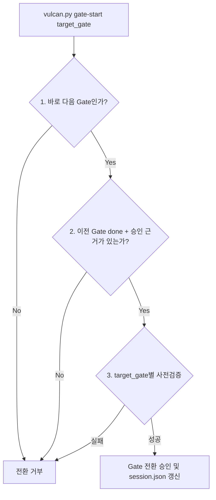

# Vulcan 5-Gate 프로세스 순서 및 vulcan.py 제어 로직 검토서

이 문서는 Vulcan-Anvil Ex 프레임워크의 5-Gate 개발 단계 순서가 현재 목표인 감리형/고보증 개발 흐름에 적합한지 검토하고, 이를 검증하고 강제하는 `vulcan.py`의 구현 레벨 보완점을 분석한 참고 리포트다.

---

## 1. 5-Gate 프로세스 순서 분석

현재 정의된 게이트 순서는 다음과 같다.

```text
phase0 탐색
→ gate1 요구사항
→ gate2 설계
→ gate3 테스트플랜
→ impl 구현
→ gate4 QA검수
→ gate5 최종승인
```

### 설계적 타당성

- **V-모델과의 정렬**: 요구사항(G1), 설계(G2), 테스트설계(G3)를 마친 후 구현(Impl)에 들어가고, 구현 후 QA검수(G4)를 거쳐 승인(G5)하는 순서는 고보증 개발 모델과 잘 맞는다.
- **피드백 루프**: Gate 4에서 발견된 결함(FIND)은 구현/QA Fix 흐름으로, 요구사항/설계 변경(CR)은 영향도 분석 후 앞 Gate로 회귀하도록 설계할 수 있다.

---

## 2. vulcan.py 구현 상의 주요 취약점 및 개선 필요성

단계 구성 자체보다 중요한 보완점은 이론적 순서가 CLI와 `session.json` 상태 수준에서 항상 강제되어야 한다는 점이다.

### [취약점 1] 게이트 건너뛰기 방어벽 부재

- **현재 현상**: `python vulcan.py gate-start <대상게이트>` 명령 실행 시 현재 세션이 어떤 Gate에 있든 임의의 대상 Gate로 이동할 수 있다.
- **예시**: `phase0` 상태에서 곧바로 `gate4`로 `gate-start`를 호출하면 순서 위반 상태가 될 수 있다.
- **개선 방향**: Gate 전환 시 `GATE_ORDER` 기준으로 바로 다음 Gate만 시작할 수 있게 한다. 바로 이전 Gate는 `gate_status[previous_gate] == "done"`이어야 하며, `session["approvals"][previous_gate].approval_evidence`가 있어야 한다.

### [취약점 2] gate-start 사전 검사 범위의 부족

- **현재 현상**: `gate-start` 시 실행되는 `validate_gate_start_prerequisites`는 주로 Phase 0의 미해결 질문/위험 요소를 확인한다.
- **영향**: `gate3`이나 `impl` 진입 시 Gate 1/2 산출물 정합성, Gate 3 테스트 계획 completeness 같은 상세 검사가 충분히 선행되지 않을 수 있다.
- **개선 방향**: 향후 `check-trace` 내부 검증 로직을 재사용 가능한 preflight 함수로 분리하고, `target_gate`별 사전검증으로 호출한다.
  - `gate2` 진입 시: Gate 1 요구사항과 AC 매핑 검사
  - `gate3` 진입 시: Gate 2 설계 산출물과 traceability 검사
  - `impl` 진입 시: Gate 3 테스트케이스와 target contract 매핑 검사

### [취약점 3] 일부 구현/통합 명령의 단계 잠금 필요

- **현재 현상**: `wave-start`는 이미 `impl` 단계에서만 실행되도록 잠겨 있다.
- **남은 보완점**: `run-integrate`처럼 worker 결과를 메인 워크트리에 반영하는 명령은 구현 또는 QA 보완 단계에서만 실행되어야 한다.
- **개선 방향**: 각 서브커맨드 실행 진입부에서 `session.json.current_gate`를 확인하여 허용되지 않은 단계일 경우 실행을 차단한다.

---

## 3. 우선 적용 액션 플랜

즉시 적용할 최소 방어벽:

1. `cmd_gate_start`에서 순차적 Gate 진행만 허용한다.
2. 이전 Gate가 `done`이고 승인 근거가 있을 때만 다음 Gate 시작을 허용한다.
3. 같은 Gate에 대한 `gate-start`는 idempotent하게 허용한다.
4. `run-integrate`는 `impl` 또는 `gate4`에서만 허용한다.

후속 보완으로 둘 항목:

1. `check-trace` 내부 검증 로직을 reusable preflight 함수로 분리한다.
2. Gate별 required artifact completeness 검사를 추가한다.
3. Gate별 상세 preflight 실패 시 어떤 산출물을 보완해야 하는지 출력한다.


