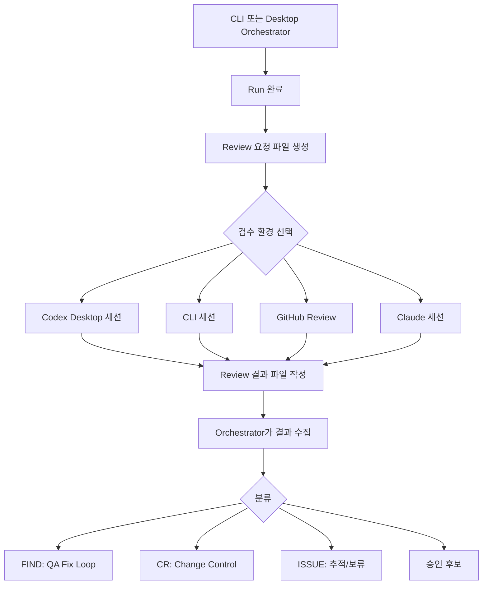

# Session Coordination Ideal Model

## 1. 목적

Vulcan-Anvil Ex는 CLI, Codex Desktop, Claude, GitHub Code Review 같은 서로 다른 실행 환경이 같은 프로젝트를 이어서 처리할 수 있어야 한다.

이 문서는 이상적인 세션 협업 구조를 정리한다. 현재 목표는 세션 간 실시간 통신을 전제로 하지 않고, 공유 저장소의 상태 파일과 리뷰 큐를 통해 느슨하게 협업하는 것이다.

## 2. 핵심 판단

세션끼리 직접 대화하거나 실시간 브로드캐스트를 받는 구조는 매력적이지만, 런타임별 제약과 의존성이 크다.

따라서 1차 모델은 다음 원칙을 따른다.

- 모든 세션은 같은 저장소의 상태 파일을 읽고 쓴다.
- 작업 요청, 검수 요청, 검수 결과는 파일로 남긴다.
- Orchestrator는 파일 상태를 기준으로 다음 행동을 결정한다.
- 실시간 이벤트는 필수가 아니라 향후 확장 옵션으로 둔다.

## 3. 공유 상태 구성

| 경로 | 역할 |
| --- | --- |
| `session.json` | 현재 프로젝트, Gate, 진행 상태, 주요 pending/blocking 항목 |
| `docs/runs/` | 에이전트 실행 단위와 결과 기록 |
| `docs/reviews/` | 별도 검수 요청과 검수 결과 후보 |
| `docs/evidence/` 또는 프로젝트별 evidence 경로 | 테스트 로그, 화면 캡처, 리포트 증적 |
| `docs/backlog/` 또는 backlog 문서 | CR, FIND, ISSUE 후속 처리 항목 |

`session.json`은 큰 상태를 담고, 세부 작업 단위는 Run과 Review 문서가 가진다. 하나의 파일에 모든 것을 몰아넣지 않는다.

## 4. 이상적인 흐름



## 5. Review Queue 모델

검수 요청은 큐처럼 동작한다. 처음에는 실제 큐 서버가 아니라 파일 시스템 큐로 충분하다.

예상 경로:

```text
docs/reviews/
  RV-001_desktop-ui-review_request.md
  RV-001_desktop-ui-review_result.md
```

요청 파일에는 다음 항목을 둔다.

- `review_id`
- `source_run`
- `requested_by`
- `target_environment`
- `persona`
- `gate`
- `related_ids`
- `scope`
- `required_checks`
- `evidence_expected`
- `status`

결과 파일에는 다음 항목을 둔다.

- `review_id`
- `source_run`
- `reviewed_by`
- `environment`
- `status`
- `verification_results`
- `evidence`
- `findings`
- `change_requests`
- `issues`
- `orchestrator_decision_needed`

## 6. 실시간 트리거의 한계

실시간으로 세션을 깨우려면 다음 중 하나가 필요하다.

- 같은 런타임 안에서 세션 간 메시지 API
- 로컬 watcher 프로세스
- WebSocket, message broker, webhook 같은 외부 이벤트 채널
- GitHub Actions 또는 PR comment 기반 트리거

현재 Codex CLI, Codex Desktop, Claude, GitHub 리뷰 환경이 모두 같은 방식으로 실시간 이벤트를 받을 수 있다고 가정하면 안 된다. 그래서 Core 규칙은 실시간 통신을 필수로 두지 않는다.

## 7. 현실적인 단계별 구현

| 단계 | 방식 | 설명 |
| --- | --- | --- |
| Level 1 | 파일 기반 수동 동기화 | Orchestrator가 review 요청 파일을 만들고, 다른 세션이 열릴 때 이를 읽어 처리한다. |
| Level 2 | Polling/Watcher | `vulcan.py review-watch` 같은 명령이 새 review 요청을 감지해 사용자에게 알린다. |
| Level 3 | GitHub/PR 연동 | review 결과를 PR comment, check summary, issue comment로 올리고 CLI가 다시 가져온다. |
| Level 4 | Event Broker | 로컬 또는 원격 이벤트 채널로 세션에 알림을 보낸다. |

처음 구현은 Level 1을 목표로 한다. Level 2부터는 편의 기능이며 Core 프로세스의 필수 조건이 아니다.

## 8. Orchestrator의 역할

Orchestrator는 다음 책임을 가진다.

- 검수 요청이 필요한지 판단한다.
- 사용자에게 handoff 또는 review queue 생성을 제안한다.
- 사용자가 수락하면 review 요청 파일을 만든다.
- 다른 세션이 작성한 결과를 읽고 `FIND`, `CR`, `ISSUE`, 승인 후보로 분류한다.
- 필요한 경우 GitHub, backlog, traceability, Run 문서를 갱신한다.

Orchestrator는 다른 세션의 결과를 자동 승인하지 않는다. 결과 파일은 판단 재료이며, 최종 결정은 Orchestrator와 사용자의 승인 흐름을 따른다.

## 9. Vulcan-Anvil Reviewer 아이디어

`vulcan-anvil reviewer` 또는 `RV`는 별도 프로그램이 될 수 있다. 다만 초기에는 큰 앱보다 `vulcan.py`의 얇은 명령으로 시작한다.

후보 명령:

```text
vulcan.py review-new --target desktop --from-run RUN-004 --title "로그인 화면 검수"
vulcan.py l2-review --gate gate4 --from-run RUN-004 --title "로그인 화면 L2 검수"
vulcan.py review-list
vulcan.py review-result --review-id RV-001 --status Completed
vulcan.py review-import --review-id RV-001
vulcan.py review-watch
```

이 명령들은 세션 간 직접 통신을 만들기보다, 공유 상태 파일을 만들고 읽는 역할을 한다.

## 10. 설계 원칙

- 실시간 통신이 없어도 이어받을 수 있어야 한다.
- 사람이 세션을 새로 열어도 무엇을 해야 하는지 파일만 보고 알 수 있어야 한다.
- 자동화가 실패해도 `session.json`, Run, Review 문서만 있으면 복구 가능해야 한다.
- GitHub나 특정 AI 런타임에 종속되지 않는다.
- 브로드캐스트와 watcher는 편의 기능이지 Core의 전제 조건이 아니다.

이 모델의 핵심은 세션끼리 직접 말하게 만드는 것이 아니라, 모든 세션이 같은 상태판을 보고 자기 역할을 수행하게 만드는 것이다.
