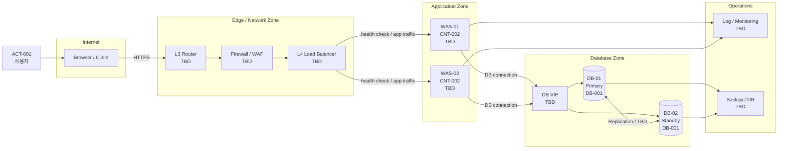

# 배포·운영 인프라 아키텍처 정의서

```yaml
---
document_id: DOC-ARCH-G2-002
title: Deployment Infrastructure Architecture
title_ko: 배포·운영 인프라 아키텍처 정의서
project: 프로젝트명
gate: G2
status: Draft
version: v0.1
owner_role: Infrastructure / Operations Lead
author: 작성자 또는 에이전트
reviewer: Orchestrator
approver: 사용자 또는 인프라/운영 의사결정자
created_at: YYYY-MM-DD
updated_at: YYYY-MM-DD
related_ids:
  - NREQ-
  - SEC-
  - CNT-
  - DEP-
change_reason: 최초 초안 작성
---
```

## 1. 문서 목적

본 문서는 SW가 실제로 배포되고 운영되는 인프라 구성을 SW 운영 관점에서 정의한다.

이 문서는 인프라팀의 상세 네트워크 설계서, 장비 구성서, 방화벽 정책서, 벤더별 설정 문서를 대체하지 않는다.
대신 SW 아키텍처, 보안가이드, 개발표준, DB명세, Gate 4 QA가 알아야 할 운영 경계와 미확정 질문을 드러낸다.

## 2. 작성 원칙

- 모르는 값을 추측해서 채우지 않는다.
- 미확정 값은 `TBD`로 두되, 확인 질문, 영향, 확인 책임, Gate 전환 전 처리 필요 여부를 함께 기록한다.
- 로컬 MVP, 단일 서버, 클라우드 PaaS, 온프레미스 이중화 구성 모두 이 문서의 대상이 될 수 있다.
- 장비 모델명, 랙 위치, 스위치 포트 번호, 벤더별 CLI 설정은 인프라 상세 문서로 위임한다.
- SW 운영자가 알아야 하는 포트, 프로토콜, TLS 종료 위치, health check, 세션, 파일 저장소, DB failover, 로그/백업/모니터링 기준은 본 문서에 남긴다.

## 3. 미확정 항목 처리 규칙

| 상태 | 의미 | Gate 처리 |
| --- | --- | --- |
| Confirmed | 사용자, 인프라 담당자, 운영 담당자 또는 공식 문서로 확인됨 | Gate 3/Impl 입력으로 사용 가능 |
| Assumed | 명시 가정으로 임시 확정. 확인 책임과 만료 시점이 있음 | Gate 3 진입 전 RISK/ASM/ISSUE 연결 필요 |
| TBD | 정보 없음. 추정 금지 | 확인 질문과 영향 필수. 구현/QA 영향 항목은 Gate 3 또는 Impl 전 처리 필요 |
| Not Applicable | 프로젝트 범위에 해당 없음 | 제외 근거 필요 |

### 3.1 인프라 확인 질문 목록

| Q-ID | 항목 | 현재 값 | 상태 | 확인 질문 | 미확정 영향 | 확인 책임 | Gate 전 처리 |
| --- | --- | --- | --- | --- | --- | --- | --- |
| Q-INFRA-001 | WAS 이중화 | TBD | TBD | WAS는 단일인가, 2대 이상인가, L4 뒤에 배치되는가? | 세션, health check, 무중단 배포 방식 결정 불가 | 사용자 / 인프라 담당자 | Gate 3 전 |
| Q-INFRA-002 | DB 이중화 | TBD | TBD | DB는 단일, Primary-Standby, Cluster, Managed DB 중 무엇인가? | failover, connection pool, 백업/복구 기준 결정 불가 | 사용자 / DBA | Impl 전 |
| Q-INFRA-003 | TLS 종료 위치 | TBD | TBD | TLS는 WAF, L4, Web/WAS 중 어디에서 종료되는가? | 인증서, redirect, secure cookie, 보안 헤더 설정 영향 | 인프라 / 보안 담당자 | Gate 3 전 |
| Q-INFRA-004 | 파일 저장소 | TBD | TBD | 업로드/첨부 파일은 로컬, NAS, Object Storage 중 어디에 저장하는가? | 다중 WAS에서 파일 접근 방식 결정 불가 | 사용자 / 운영 담당자 | Impl 전 |
| Q-INFRA-005 | 운영 로그 | TBD | TBD | 애플리케이션 로그는 파일, stdout, 중앙 수집 중 무엇을 사용하는가? | 장애 분석, 개인정보 마스킹, 보관 기간 결정 불가 | 운영 담당자 | Impl 전 |

## 4. 인프라 구성 개요

| 항목 | 값 | 상태 | 관련 ID | 비고 |
| --- | --- | --- | --- | --- |
| 배포 환경 | local / dev / stage / prod / cloud / on-premise / TBD | TBD | DEP- |  |
| 주요 Zone | Internet / DMZ / App / DB / Mgmt / TBD | TBD | SEC- / NREQ- |  |
| L2/L3 구성 | TBD | TBD | NREQ- | 상세 장비 설정은 인프라 문서 참조 |
| L4/Load Balancer | 사용 / 미사용 / TBD | TBD | NREQ- / SEC- | health check URL 필요 |
| WAF/FW | 사용 / 미사용 / TBD | TBD | SEC- | 포트/정책 연결 |
| Web/WAS | 단일 / 2대 / N대 / TBD | TBD | CNT- / DEP- | 세션/배포 영향 |
| DB | 단일 / Primary-Standby / Cluster / Managed / TBD | TBD | DB- / NREQ- | failover/backup 영향 |
| 파일 저장소 | Local / NAS / Object Storage / TBD | TBD | NREQ- | 다중 WAS 영향 |
| 모니터링 | TBD | TBD | NREQ- | health, log, metric |
| 백업/DR | TBD | TBD | NREQ- | RPO/RTO 연결 |

## 5. 배포·운영 구성도

### 5.1 권장 Mermaid 구성도



### 5.2 구성도 작성 기준

- 경계는 `Internet`, `DMZ`, `Application Zone`, `Database Zone`, `Operations`처럼 명확히 표시한다.
- 화살표에는 포트, 프로토콜, TLS 여부, 인증 방식 또는 traffic 종류를 적는다.
- 이중화 구성은 Active-Active, Active-Standby, Cluster, Managed 서비스 중 하나로 분류한다.
- `TBD` 노드는 3.1 확인 질문 또는 14장 미확정 항목과 연결한다.

## 6. 네트워크 Zone과 접근 경로

| Zone-ID | Zone | 포함 구성요소 | Inbound | Outbound | 보안 통제 | 상태 |
| --- | --- | --- | --- | --- | --- | --- |
| ZONE-001 | Internet | 사용자 브라우저 | HTTPS 443 / TBD | Edge | TLS / WAF / TBD | TBD |
| ZONE-002 | DMZ / Edge | L3, FW/WAF, L4 | Internet | App Zone | ACL / Policy / TBD | TBD |
| ZONE-003 | App Zone | Web/WAS | Edge | DB Zone, Ops | SG/FW / TBD | TBD |
| ZONE-004 | DB Zone | DB 서버 | App Zone | Backup/Ops | DB ACL / TBD | TBD |
| ZONE-005 | Mgmt/Ops | Log, Monitoring, Backup | App/DB | Admin / Storage | 계정/권한 / TBD | TBD |

## 7. 구성요소 목록

| INFRA-ID | 유형 | 이름 | 수량 | 역할 | 이중화 | 관련 CNT/DB/DEP | 상태 |
| --- | --- | --- | --- | --- | --- | --- | --- |
| INFRA-001 | L3 | TBD | TBD | 라우팅 | TBD | SEC- / NREQ- | TBD |
| INFRA-002 | FW/WAF | TBD | TBD | 접근통제 / 웹 보안 | TBD | SEC- | TBD |
| INFRA-003 | L4 | TBD | TBD | 부하분산 / health check | TBD | CNT- / DEP- | TBD |
| INFRA-004 | WAS | TBD | TBD | 애플리케이션 실행 | TBD | CNT- | TBD |
| INFRA-005 | DB | TBD | TBD | 데이터 저장 | TBD | DB- | TBD |
| INFRA-006 | Storage | TBD | TBD | 파일 저장 | TBD | NREQ- | TBD |
| INFRA-007 | Monitoring | TBD | TBD | 로그/메트릭/알림 | TBD | NREQ- | TBD |

## 8. 포트/프로토콜/방화벽 기준

| FLOW-ID | From | To | Port/Protocol | 인증/TLS | 목적 | 관련 SEC/NREQ | 상태 |
| --- | --- | --- | --- | --- | --- | --- | --- |
| FLOW-INFRA-001 | Browser | L4/WAF | 443/HTTPS | TLS | 사용자 요청 | SEC- | TBD |
| FLOW-INFRA-002 | L4 | WAS | 8080/HTTP or HTTPS / TBD | TBD | App traffic / health check | SEC- / NREQ- | TBD |
| FLOW-INFRA-003 | WAS | DB | 5432/3306/1521/TBD | TBD | DB connection | SEC- / DB- | TBD |
| FLOW-INFRA-004 | WAS | Log/Monitoring | TBD | TBD | 로그/메트릭 전송 | NREQ- | TBD |

## 9. 이중화와 장애 대응

| 대상 | 구성 | 장애 감지 | Failover 방식 | 애플리케이션 영향 | 확인 질문 | 상태 |
| --- | --- | --- | --- | --- | --- | --- |
| L4 | TBD | health check / TBD | TBD | health check URL 필요 | L4 health check 경로와 기준은? | TBD |
| WAS | TBD | L4 / monitoring / TBD | traffic 제외 / 재기동 / TBD | 세션, 배포, 로그 영향 | 세션은 sticky, shared, stateless 중 무엇인가? | TBD |
| DB | TBD | DB monitor / TBD | VIP 전환 / managed failover / TBD | connection retry, transaction 영향 | failover 시 앱 재기동이 필요한가? | TBD |
| Storage | TBD | TBD | TBD | 파일 접근/업로드 영향 | 다중 WAS에서 파일 일관성은 어떻게 보장하는가? | TBD |

## 10. SW 설계/구현 영향

| 영향 영역 | 인프라 결정 | SW 반영 필요사항 | 관련 문서 | 상태 |
| --- | --- | --- | --- | --- |
| Health Check | L4 health check URL | `/health`, `/actuator/health`, 인증 제외 여부 | API Spec / Security Guide / Development Standard | TBD |
| Session | WAS 이중화 | stateless token, sticky session, shared session 선택 | Security Guide / SW Architecture | TBD |
| DB Connection | DB 이중화 | connection pool, timeout, retry, failover driver 설정 | DB Spec / Development Standard | TBD |
| TLS | TLS 종료 위치 | secure cookie, redirect, HSTS, forwarded header 설정 | Security Guide | TBD |
| File Upload | 저장소 위치 | local 금지 여부, NAS/Object Storage client, 백업 | Program Design / DB Spec | TBD |
| Logging | 로그 수집 방식 | JSON log, correlation id, PII masking, retention | Development Standard / Security Guide | TBD |

## 11. 배포/롤백 기준

| DEP-ID | 배포 단위 | 배포 대상 | 배포 방식 | 무중단 가능 여부 | 롤백 방식 | 관련 Run/QA |
| --- | --- | --- | --- | --- | --- | --- |
| DEP-001 | Backend/API | WAS | 수동 / CI/CD / TBD | TBD | 이전 artifact / git tag / TBD | RUN- / QA- |
| DEP-002 | Frontend | Web/WAS/CDN | 수동 / CI/CD / TBD | TBD | 이전 build / CDN rollback / TBD | RUN- / QA- |
| DEP-003 | DB Migration | DB | 수동 / migration tool / TBD | TBD | rollback script / backup restore / TBD | RUN- / QA- |

## 12. 운영 로그/모니터링/백업

| 영역 | 기준 | 도구/위치 | 보관 기간 | 알림 기준 | 관련 NREQ/SEC | 상태 |
| --- | --- | --- | --- | --- | --- | --- |
| App Log | TBD | TBD | TBD | TBD | NREQ- / SEC- | TBD |
| Access Log | TBD | L4/WAF/WAS / TBD | TBD | TBD | SEC- | TBD |
| DB Backup | TBD | TBD | TBD | TBD | NREQ- | TBD |
| Metric | CPU/Mem/Latency/Error / TBD | TBD | TBD | TBD | NREQ- | TBD |
| Audit Log | TBD | TBD | TBD | TBD | SEC- | TBD |

## 13. 보안 연결

| 보안 항목 | 인프라 적용 위치 | SW 적용 위치 | 관련 SEC | 상태 |
| --- | --- | --- | --- | --- |
| TLS | WAF/L4/WAS / TBD | secure cookie, forwarded header | SEC- | TBD |
| 접근통제 | FW/WAF/SG / TBD | API authz, admin path 제한 | SEC- | TBD |
| 비밀정보 | Secret manager / env / TBD | 환경변수, config 분리 | SEC- | TBD |
| 로그 마스킹 | Log collector / TBD | app log masking | SEC- | TBD |
| 관리자 접근 | VPN/Bastion / TBD | admin role, audit log | SEC- | TBD |

## 14. 미확정 항목 대장

| ID | 미확정 항목 | 상태 | 영향 | 확인 질문 | 확인 책임 | 목표 시점 | 처리 결과 |
| --- | --- | --- | --- | --- | --- | --- | --- |
| ISSUE-INFRA-001 | WAS 이중화 방식 | TBD | 세션/배포/health check | WAS 수량과 L4 구성을 확인해야 함 | 사용자 / 인프라 | Gate 3 전 | Open |
| ISSUE-INFRA-002 | DB 이중화/백업 | TBD | connection pool, 장애 대응, 복구 기준 | DB HA와 백업 정책을 확인해야 함 | DBA / 운영 | Impl 전 | Open |

## 15. 추적성 연결

| 인프라 ID | 연결 문서 | 연결 ID | 설명 |
| --- | --- | --- | --- |
| INFRA-003 | DOC-ARCH-G2-001_SW-Architecture_v0.1.md | CNT- / DEP- | L4와 실행 컨테이너 연결 |
| INFRA-004 | DOC-DEV-G2-001_Development-Standard_v0.1.md | DEV- / DEP- | 런타임, 로그, 배포 명령 연결 |
| INFRA-005 | DOC-DATA-G2-002_Database-Spec_v0.1.md | DB- | DB 배치, HA, 백업 연결 |
| FLOW-INFRA-001 | DOC-SEC-G2-001_Security-Guide_v0.1.md | SEC- | TLS, 접근통제 연결 |
| ISSUE-INFRA-001 | DOC-CORE-G4-001_Traceability-Matrix_v0.1.md | RISK- / ISSUE- | 미확정 인프라 영향 추적 |

## 16. Gate 2 체크리스트

| 확인 항목 | 결과 | 비고 |
| --- | --- | --- |
| 배포 환경과 주요 Zone이 작성되었는가 | 예 / 아니오 / TBD |  |
| L2/L3/L4/WAF/FW/WAS/DB/Storage/Monitoring 중 해당 구성이 표시되었는가 | 예 / 아니오 / TBD |  |
| WAS 이중화와 health check 기준이 확인되었는가 | 예 / 아니오 / TBD |  |
| DB 이중화, 백업, failover 영향이 정리되었는가 | 예 / 아니오 / TBD |  |
| TLS 종료 위치와 인증서 책임이 정리되었는가 | 예 / 아니오 / TBD |  |
| 파일 저장소와 다중 WAS 영향이 정리되었는가 | 예 / 아니오 / 해당없음 / TBD |  |
| 로그/모니터링/백업 기준이 개발표준/보안가이드와 연결되었는가 | 예 / 아니오 / TBD |  |
| 모든 TBD에 확인 질문, 영향, 확인 책임, 목표 시점이 있는가 | 예 / 아니오 |  |
| 구현/QA에 영향을 주는 TBD가 Gate 3 전 RISK/ASM/ISSUE/CR로 분류되었는가 | 예 / 아니오 |  |
