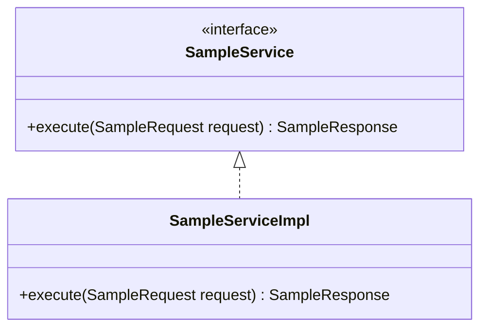

# 프로그램 설계서

```yaml
---
document_id: DOC-CORE-G2-002
title: Program Design Specification
title_ko: 프로그램 설계서
project: 프로젝트명
gate: G2
status: Draft
version: v0.1
owner_role: Technical Architect
author: 작성자 또는 에이전트
reviewer: Security Reviewer
approver: Approver
created_at: YYYY-MM-DD
updated_at: YYYY-MM-DD
related_ids:
  - PGM-001
change_reason: 최초 초안 작성
---
```

## 1. 문서 목적

본 문서는 기능명세서의 `FUNC`를 실제 구현 가능한 프로그램, 컴포넌트, 클래스, 인터페이스, public method contract로 전개한다.

프로그램 설계서는 "무엇을 구현할 것인가"를 넘어, worker가 같은 설계를 기준으로 구현, 확장, 리팩토링할 수 있도록 공개 계약과 책임 경계를 고정한다.

API가 있는 경우 요청/응답/상태코드/예시는 API 정의서에서 상세화하고, 본 문서는 해당 API를 처리하는 Controller, Service, Repository, Component, DTO, 예외, 트랜잭션, 로깅, 테스트 계약을 정의한다.

## 2. 작성 기준

- 프로그램은 `PGM-001` 형식으로 부여한다.
- 프로그램은 하나 이상의 `REQ`, `AC`, `FUNC`와 연결한다.
- 프로그램 설계는 공개 계약을 우선한다. private helper의 세부 구현은 Impl worker에게 맡길 수 있다.
- 공개 method/event signature에는 선택한 스택에 맞는 parameter, return, error/exception type을 명시한다.
- 구현 worker가 임의의 class, method, schema, 파일 경로를 만들지 않도록 Class/Component Contract와 Public Method Contract를 먼저 고정한다.
- 신규 개발은 Impl의 첫 Wave에서 Contract Skeleton을 만들 수 있도록 skeleton 대상 파일, public signature, 테스트 골격을 식별한다.
- Java/Spring 계열은 필요한 경우 `interface`, `abstract class`, 구현체, DTO, Entity, Repository contract를 명시한다.
- Frontend 계열은 component, composable/hook, API client, state/event contract를 명시한다.
- Frontend와 API가 연동되면 상태 동기화, 실패 시 복구/rollback, 재조회/refetch, 사용자 오류 표시 위치를 명시한다.
- 외부 endpoint, DB URL, feature flag처럼 환경별로 달라지는 값은 environment/config contract로 분리하고 코드 하드코딩 허용 여부를 정한다.
- 보안, 트랜잭션, 입력 검증, 오류/메시지, 로깅, 감사는 public contract와 함께 작성한다.
- 단위테스트는 public method 또는 주요 정책/검증 로직을 기준으로 연결한다.
- API가 없으면 API 관련 칸은 `해당없음`으로 쓰고, 프로그램 유형은 `Module`, `Service`, `Batch`, `Component`, `CLI`, `Policy`, `Validator`처럼 실제 유형으로 작성한다.
- 복잡한 상속, 구현 관계, 상태 전이, 외부 연계가 있으면 Mermaid class/sequence/state/activity diagram을 작성한다.
- 다이어그램이 불필요하면 생략 사유를 남긴다.

## 3. 프로그램/컴포넌트 목록

| PGM-ID | 프로그램/컴포넌트 | 유형 | 패키지/경로 | 관련 FUNC | 관련 API/SCR | 관련 DB | 관련 SEC | 상태 |
| --- | --- | --- | --- | --- | --- | --- | --- | --- |
| PGM-001 |  | Service / Component |  | FUNC- | API- / SCR- | DB- | SEC- | Draft |

## 4. 패키지 및 모듈 구조

| 영역 | 기준 패키지/경로 | 책임 | 변경 허용 기준 |
| --- | --- | --- | --- |
| Controller / Route |  | 요청 수신, 인증/인가 진입, DTO 변환 | API 계약 변경 시 |
| Service / UseCase |  | 비즈니스 규칙, 트랜잭션, 정책 호출 | FUNC/PGM 계약 변경 시 |
| Repository / Adapter |  | 데이터 접근, 외부 시스템 호출 | DB/API adapter 계약 변경 시 |
| DTO / Model |  | 입력/출력 계약 | API/화면/프로그램 계약 변경 시 |
| Policy / Validator |  | 검증, 보안, 정책 판단 | SEC/AC 변경 시 |

## 5. Interface Contract

> 구현자가 반드시 따라야 하는 public interface 또는 외부 호출 가능한 component contract를 작성한다.
> Build Wave Run은 이 표와 아래 언어별 signature 예시를 `target_contracts.interface_contract`로 잘라 worker에게 전달한다.

| Interface-ID | PGM-ID | 인터페이스명 | 패키지/경로 | 구현체 | 관련 FUNC/API/SEC | 비고 |
| --- | --- | --- | --- | --- | --- | --- |
| IF-001 | PGM-001 |  |  |  | FUNC- / API- / SEC- |  |

### 5.1 Python / FastAPI 예시

```python
from typing import Protocol

from app.schemas.todos import TodoCreate, TodoOut, TodoUpdate


class TodoService(Protocol):
    """PGM-001 / IF-001: Todo 업무 규칙 public contract."""

    def list_todos(self) -> list[TodoOut]:
        """REQ-001, API-001. 최신 수정순 Todo 목록을 반환한다."""

    def create_todo(self, request: TodoCreate) -> TodoOut:
        """REQ-002, API-002, SEC-001. text trim, 1~140자 검증 후 생성한다."""

    def update_todo_completed(self, todo_id: int, request: TodoUpdate) -> TodoOut:
        """REQ-003, API-003. 존재하지 않는 id는 TODO_NOT_FOUND로 처리한다."""

    def delete_todo(self, todo_id: int) -> None:
        """REQ-004, API-004. 삭제 성공 시 반환값은 없다."""
```

### 5.2 Java / Spring 예시

```java
/**
 * PGM-001 / IF-001.
 * Todo 업무 규칙을 수행하는 public service contract.
 */
public interface TodoService {
    List<TodoResponse> listTodos();

    TodoResponse createTodo(TodoCreateRequest request);

    TodoResponse updateTodoCompleted(Long todoId, TodoUpdateRequest request);

    void deleteTodo(Long todoId);
}

/**
 * PGM-001 / IF-002.
 * Todo 영속성 접근 contract. 구현체는 DB 기술에 따라 분리한다.
 */
public interface TodoRepository {
    List<TodoEntity> findAllOrderByUpdatedAtDesc();

    TodoEntity save(TodoEntity todo);

    Optional<TodoEntity> findById(Long todoId);

    void delete(TodoEntity todo);
}
```

### 5.3 TypeScript / Frontend 예시

```ts
export type Todo = {
  id: number;
  text: string;
  completed: boolean;
  createdAt: string;
  updatedAt: string;
};

export interface TodoApiClient {
  fetchTodos(): Promise<Todo[]>;
  addTodo(text: string): Promise<Todo>;
  setCompleted(id: number, completed: boolean): Promise<Todo>;
  removeTodo(id: number): Promise<void>;
}

export type UseTodosResult = {
  todos: Todo[];
  isLoading: boolean;
  isSaving: boolean;
  errorMessage: string;
  createTodo(text: string): Promise<boolean>;
  updateCompleted(id: number, completed: boolean): Promise<void>;
  deleteTodo(id: number): Promise<void>;
};
```

## 6. Abstract Base Contract

> 공통 응답, 공통 예외 처리, 감사/로깅, 공통 검증처럼 오버라이드 기준이 필요한 경우에만 작성한다. 없으면 생략 사유를 남긴다.

| Abstract-ID | 추상 클래스/기반 컴포넌트 | 적용 대상 | protected/public 메소드 | 오버라이드 규칙 | 생략/적용 사유 |
| --- | --- | --- | --- | --- | --- |
| ABS-001 |  |  |  |  |  |

```java
public abstract class BaseController {
    protected <T> ApiResponse<T> ok(T data) {
        return ApiResponse.ok(data);
    }
}
```

## 7. Class / Component Responsibility

### PGM-001 프로그램/컴포넌트명

| 항목 | 내용 |
| --- | --- |
| PGM-ID | PGM-001 |
| 이름 |  |
| 유형 | Controller / Service / Repository / Component / Policy / Validator / Entity / DTO |
| 패키지/경로 |  |
| 설명 |  |
| 관련 요구사항 | REQ- |
| 관련 인수기준 | AC- |
| 관련 기능 | FUNC- |
| 관련 화면/API | SCR- / API- |
| 관련 데이터 | DB- |
| 관련 보안항목 | SEC- |
| 주요 책임 |  |
| 책임 제외 |  |
| 상태 동기화/복구 전략 | Frontend/API 상태 동기화가 있으면 optimistic update, loading lock, rollback, refetch 기준을 작성한다. 없으면 `해당없음` |
| 외부 호출/재시도 기준 | 외부 API, backend API, queue, 파일 I/O 호출이 있으면 timeout, retry, 실패 처리 기준을 작성한다. 없으면 `해당없음` |
| 사용자 오류 표시 기준 | 화면/API/CLI 사용자 오류가 있으면 표시 위치, 메시지 코드, 접근성 또는 로그 분리 기준을 작성한다. 없으면 `해당없음` |

## 8. Public Method Contract

> Worker Run은 이 표의 계약 단위를 기준으로 쪼갠다. 하나의 worker Run은 기능/계약상 완결되어야 하며, 시간은 보조 기준으로만 사용한다.
> 시그니처/이벤트는 `execute(request)`처럼 모호하게 두지 말고, 스택에 맞는 입력/출력/오류 타입을 함께 적는다. 단, private helper의 내부 알고리즘은 worker 재량으로 남길 수 있다.
> Interface Contract의 간단 signature와 이 표의 상세 signature가 다르면 이 표를 기준으로 정정하고, 불일치는 Gate 2 Review에서 FIND로 처리한다.

| Method-ID | PGM-ID | 시그니처/이벤트 | 입력 | 출력 | 검증/정책 | 오류/예외 | 트랜잭션 | 로그/감사 | 관련 ID |
| --- | --- | --- | --- | --- | --- | --- | --- | --- | --- |
| MTH-001 | PGM-001 | `execute(request)` | Request DTO | Response DTO | AC- / SEC- | ERR-001 | Required / None | INFO/ERROR 기준 | REQ- / FUNC- / API- / UT- |

작성 예:

```text
AuthService.signup(request: SignupRequest): SignupResult
- input: email, password, passwordConfirm
- validation: 이메일 형식, 비밀번호 정책, 중복 이메일
- output: userId, email, createdAt
- errors: DUPLICATE_EMAIL, WEAK_PASSWORD, PASSWORD_CONFIRM_MISMATCH
- related: REQ-001, AC-001-01, FUNC-AUTH-001, API-AUTH-001, SEC-PWD-001, UT-AUTH-001
```

## 9. DTO / Entity / Data Contract

| Contract-ID | 유형 | 이름 | 필드 | 제약/검증 | 관련 DB/API/SCR | 비고 |
| --- | --- | --- | --- | --- | --- | --- |
| DTO-001 | Request / Response / Entity / ValueObject |  |  |  | DB- / API- / SCR- |  |

환경/설정 계약:

| Config-ID | 이름 | 사용 위치 | 값 출처 | 기본값 | 하드코딩 허용 여부 | 검증 방법 |
| --- | --- | --- | --- | --- | --- | --- |
| CFG-001 | 예: API Base URL | frontend API client | `.env`, application config, secret manager |  | 금지/허용 | UT-/IT- |

## 10. Error / Exception / Message Contract

| 오류 ID | 발생 조건 | 예외/코드 | 사용자 메시지 | 로그 수준 | HTTP 상태/API 오류 | 관련 AC/SEC |
| --- | --- | --- | --- | --- | --- | --- |
| ERR-001 |  |  |  | WARN / ERROR | 400 / 401 / 403 / 409 / 500 | AC- / SEC- |

## 11. Transaction / Security / Logging Contract

| PGM/Method | 트랜잭션 경계 | 인증/인가 | 입력 검증 | 민감정보 처리 | 로깅/감사 | 검증 테스트 |
| --- | --- | --- | --- | --- | --- | --- |
| PGM-001 / MTH-001 | Required / ReadOnly / None |  |  |  |  | UT- / IT- |

## 12. Test Mapping

| 테스트 ID | 유형 | 검증 대상 | 관련 Method/PGM | 관련 AC/SEC/NREQ | 비고 |
| --- | --- | --- | --- | --- | --- |
| UT-001 | Unit |  | MTH-001 / PGM-001 | AC- / SEC- / NREQ- |  |

## 13. Contract Skeleton 후보

> Impl 첫 Wave에서 업무 로직 구현 전에 만들 뼈대 파일을 정의한다. 신규 개발이면 필수이며, 고도화면 기존 파일과 설계 계약의 매핑 또는 누락 skeleton 보강 범위를 적는다.

| Skeleton-ID | 대상 PGM/IF/MTH | 파일 경로 | 생성할 public 계약 | 업무 로직 포함 여부 | 검증 smoke |
| --- | --- | --- | --- | --- | --- |
| SKEL-001 | PGM-001 / IF-001 / MTH-001~004 |  | class/interface/method signature, DTO import, TODO 또는 NotImplemented stub | 금지 / 최소 stub만 허용 | compile/import/build smoke |

## 14. 상세 SW 설계 다이어그램

| PGM-ID | 복잡도 | 상속/구현 관계 | 상태 전이 | 외부/비동기 연계 | 권장 다이어그램 | 필요 여부 | 생략 사유 |
| --- | --- | --- | --- | --- | --- | --- | --- |
| PGM-001 | Low / Medium / High | 있음 / 없음 | 있음 / 없음 | 있음 / 없음 | Class / State / Sequence / Activity | 필요 / 불필요 |  |



## 15. Worker Run 분할 기준

프로그램 설계서는 구현 Run을 쪼개는 기준이다.

| 기준 | 규칙 |
| --- | --- |
| 1차 기준 | 기능/계약 단위로 나눈다. `FUNC/PGM/API/DB/SEC/TEST` 연결이 명확해야 한다. |
| 완결성 | Run 하나가 끝나면 빌드/테스트/리뷰 가능한 결과가 있어야 한다. |
| 머지 가능성 | 해당 Run만 반영해도 코드베이스가 깨지지 않아야 한다. |
| 시간 기준 | 목표 10분 내외, 최대 15분 권장. 시간은 보조 기준이다. |
| 분리 기준 | 15분을 넘길 것 같으면 개발 중단이 아니라 더 작은 기능/계약 단위로 다시 나눈다. |
| 금지 | 컴파일/테스트가 깨지는 반쪽 구현, 시간 종료에 따른 미완성 종료, unrelated 리팩터링 |

## 16. 변경이력

| 버전 | 일자 | 변경내용 | 작성자 | 검토자 | 승인자 |
| --- | --- | --- | --- | --- | --- |
| v0.1 | YYYY-MM-DD | 최초 초안 작성 |  |  |  |

## 17. 검토 체크리스트

| 항목 | 확인 |
| --- | --- |
| 모든 프로그램/컴포넌트에 `PGM-ID`가 부여되었는가 |  |
| 프로그램이 `REQ`, `AC`, `FUNC`와 연결되었는가 |  |
| interface/abstract class/public method contract가 필요한 수준까지 작성되었는가 |  |
| public method/event signature가 입력/출력/오류 타입까지 명확한가 |  |
| DTO/Entity/Data contract가 API/DB/화면과 모순되지 않는가 |  |
| 환경별 endpoint/config 값의 하드코딩 방지 또는 허용 기준이 명시되었는가 |  |
| Frontend/API 연동 컴포넌트의 상태 동기화, rollback/refetch, 사용자 오류 표시 기준이 명시되었는가 |  |
| 오류/예외/메시지/로그 기준이 보안가이드와 일치하는가 |  |
| 트랜잭션, 인증/인가, 입력 검증, 민감정보 처리 기준이 작성되었는가 |  |
| 테스트가 public method 또는 주요 정책 단위와 연결되었는가 |  |
| 신규 개발 또는 큰 고도화면 Contract Skeleton 후보가 식별되었는가 |  |
| Worker Run으로 나눌 수 있는 기능/계약 단위가 식별되었는가 |  |
