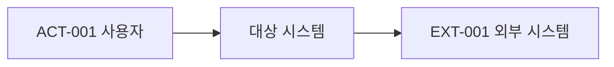
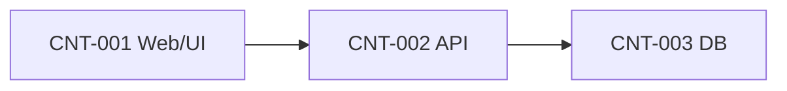
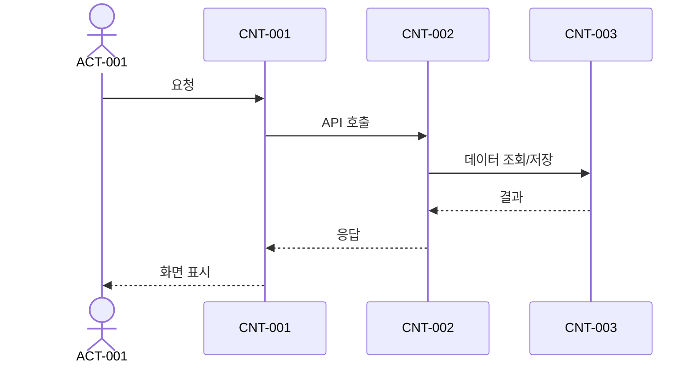

# SW 아키텍처 정의서

```yaml
---
document_id: DOC-ARCH-G2-001
title: Software Architecture Specification
title_ko: SW 아키텍처 정의서
project: 프로젝트명
gate: G2
status: Draft
version: v0.1
owner_role: Architecture Lead
author: 작성자 또는 에이전트
reviewer: Orchestrator
approver: 사용자 또는 의사결정자
created_at: YYYY-MM-DD
updated_at: YYYY-MM-DD
related_ids:
  - REQ-
  - NREQ-
  - SEC-
change_reason: 최초 초안 작성
---
```

## 1. 문서 목적

본 문서는 요구사항, 기능명세, 프로그램명세, API 정의서, DB명세, 화면설계서, 보안가이드, 개발표준을 하나의 실행 가능한 구조로 묶는 SW 아키텍처 기준을 정의한다.

아키텍처 정의서는 Gate 2 설계의 중심 산출물이며, 이후 상세 설계와 구현 Wave는 본 문서의 Container, Component, Flow, ADR, 품질속성 기준을 따라야 한다.

## 2. 작성 기준

- 최소 하나 이상의 C1 시스템 컨텍스트 다이어그램을 작성한다.
- 최소 하나 이상의 C2 컨테이너 다이어그램 또는 컨테이너 표를 작성한다.
- 구현 대상 실행 단위는 `CNT-ID`로 식별한다.
- 주요 내부 구성요소는 `CMP-ID`로 식별한다.
- 주요 처리 흐름은 `FLOW-ID`로 식별한다.
- 아키텍처 결정은 `ADR-ID`로 기록한다.
- 품질속성은 `NREQ-ID`, 보안 관심사는 `SEC-ID`와 연결한다.
- 단순 샘플, 예시, 설명용 ID를 남기지 않는다. 실제 프로젝트 기준으로 작성한다.
- 확정되지 않은 항목은 `Draft` 또는 `Open`으로 두되, Gate 3 진입 전 검토 Run에서 보완한다.

## 3. 아키텍처 요약

| 항목 | 내용 |
| --- | --- |
| 아키텍처 스타일 | Layered / MVC / Hexagonal / Monolith / Microservice / Event-driven |
| 주요 실행 단위 | CNT- |
| 주요 품질속성 | NREQ- |
| 주요 보안 관심사 | SEC- |
| 주요 외부 연계 | IF- / API- |
| 주요 제약 | RISK- / ASM- / CON- |

## 4. C1 시스템 컨텍스트

### 4.1 컨텍스트 설명

| Actor/System-ID | 이름 | 유형 | 설명 | 주요 연결 | 관련 REQ/NREQ/SEC |
| --- | --- | --- | --- | --- | --- |
| ACT-001 |  | 사용자 / 관리자 / 외부 시스템 |  | CNT- / EXT- | REQ- |
| EXT-001 |  | 외부 시스템 |  | CNT- / IF- | REQ- / NREQ- |

### 4.2 C1 다이어그램



## 5. C2 컨테이너 구조

| CNT-ID | 이름 | 책임 | 기술/런타임 | 배포 단위 | 데이터 저장소 | 관련 REQ/NREQ/SEC |
| --- | --- | --- | --- | --- | --- | --- |
| CNT-001 |  |  |  |  | DB- / 외부 저장소 | REQ- / NREQ- / SEC- |

### 5.1 C2 다이어그램



## 6. C3 컴포넌트 구조

| CMP-ID | CNT-ID | 컴포넌트명 | 책임 | 주요 인터페이스 | 관련 PGM/API/DB/SCR | 관련 REQ/SEC |
| --- | --- | --- | --- | --- | --- | --- |
| CMP-001 | CNT-001 |  |  | API- / PGM- | SCR- / PGM- / DB- | REQ- / SEC- |

## 7. 주요 처리 흐름

| FLOW-ID | 시나리오 | 시작 주체 | 주요 단계 | 오류/예외 흐름 | 관련 REQ/AC/SEC |
| --- | --- | --- | --- | --- | --- |
| FLOW-001 |  | ACT- | CNT- -> CNT- -> DB- | ERR- / FIND- 후보 | REQ- / AC- / SEC- |

### 7.1 대표 시퀀스



## 8. 품질속성 설계

| QA-ID | 관련 NREQ | 품질속성 | 목표 | 아키텍처 전략 | 검증 방법 |
| --- | --- | --- | --- | --- | --- |
| QA-001 | NREQ- | 성능 / 보안 / 가용성 / 유지보수성 / 확장성 |  | CNT- / CMP- / ADR- | PT- / IT- / 리뷰 |

## 9. 보안 아키텍처

| SEC-ID | 보안 관심사 | 아키텍처 적용 방식 | 적용 위치 | 참조 표준 | 검증 |
| --- | --- | --- | --- | --- | --- |
| SEC-001 |  |  | CNT- / CMP- / API- / DB- | KISA-SD-2021 SR- / OWASP / CWE | UT- / IT- / UI- |

## 10. 데이터 및 연계 구조

| 항목 ID | 유형 | 설명 | 연결 대상 | 실패/재처리 기준 | 관련 문서 |
| --- | --- | --- | --- | --- | --- |
| DB-001 | 데이터 저장소 |  | CNT- / CMP- | 백업 / 복구 / 트랜잭션 | DB명세서 |
| IF-001 | 외부 연계 |  | EXT- / API- | 재시도 / 보상 / 수동처리 | API정의서 / 인터페이스 정의서 |

## 11. 배포 및 운영 관점

| DEP-ID | 배포 단위 | 환경 | 구성/시크릿 | 로그/모니터링 | 장애 대응 |
| --- | --- | --- | --- | --- | --- |
| DEP-001 | CNT- | local / dev / stage / prod | ENV- / Secret | LOG- / MON- | RUNBOOK- |

## 12. 아키텍처 결정 기록

| ADR-ID | 결정사항 | 선택안 | 대안 | 결정 사유 | 영향 범위 | 상태 |
| --- | --- | --- | --- | --- | --- | --- |
| ADR-001 |  |  |  |  | CNT- / CMP- / REQ- / NREQ- / SEC- | Proposed / Accepted / Superseded |

## 13. 상세 설계 연결

| 관련 ID | 연결 문서 | 연결 내용 |
| --- | --- | --- |
| CNT-001 | 기능명세서 / 프로그램명세서 / 화면설계서 / API정의서 / DB명세서 |  |
| CMP-001 | 프로그램명세서 |  |
| FLOW-001 | 테스트케이스 / 추적표 |  |

## 14. Gate 2 검토 체크리스트

| 확인 항목 | 결과 | 비고 |
| --- | --- | --- |
| C1 시스템 컨텍스트가 작성되었는가 | 예 / 아니오 |  |
| C2 컨테이너 구조가 작성되었는가 | 예 / 아니오 |  |
| C3 컴포넌트 구조가 상세 설계와 연결되었는가 | 예 / 아니오 |  |
| 주요 처리 흐름이 `FLOW-ID`로 식별되었는가 | 예 / 아니오 |  |
| 품질속성이 `NREQ-ID`와 연결되었는가 | 예 / 아니오 |  |
| 보안 아키텍처가 `SEC-ID`와 연결되었는가 | 예 / 아니오 |  |
| 주요 기술/구조 결정이 `ADR-ID`로 기록되었는가 | 예 / 아니오 |  |
| 상세 설계 문서와 추적표에 연결 가능한 ID가 있는가 | 예 / 아니오 |  |
