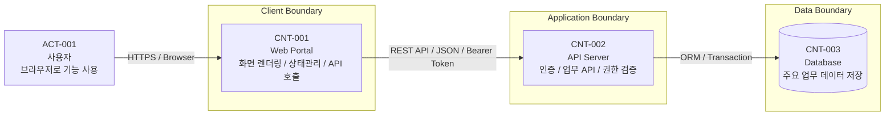
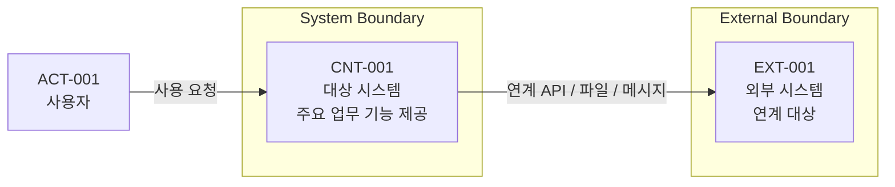
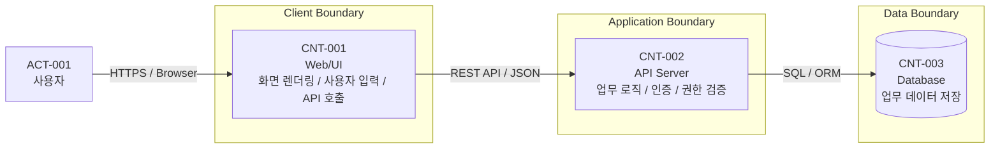
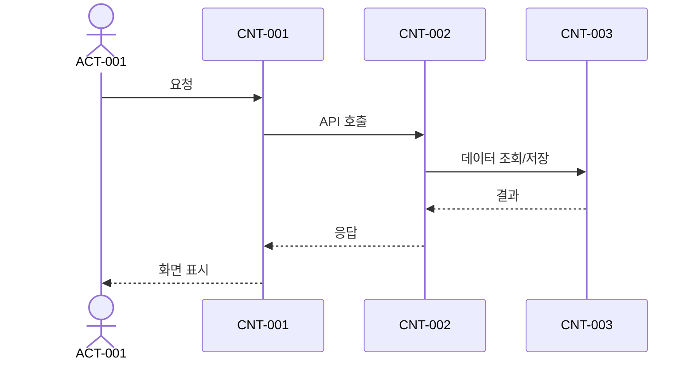

# SW 아키텍처 정의서

```yaml
---
document_id: DOC-ARCH-G2-001
title: Software Architecture Specification
title_ko: SW 아키텍처 정의서
project: 프로젝트명
gate: G2
status: Draft
version: v0.1
owner_role: Architecture Lead
author: 작성자 또는 에이전트
reviewer: Orchestrator
approver: 사용자 또는 의사결정자
created_at: YYYY-MM-DD
updated_at: YYYY-MM-DD
related_ids:
  - REQ-
  - NREQ-
  - SEC-
change_reason: 최초 초안 작성
---
```

## 1. 문서 목적

본 문서는 요구사항, 기능명세, 프로그램 설계, API 정의서, DB명세, 화면설계서, 보안가이드, 개발표준을 하나의 실행 가능한 구조로 묶는 SW 아키텍처 기준을 정의한다.

아키텍처 정의서는 Gate 2 설계의 중심 산출물이며, 이후 상세 설계와 구현 Wave는 본 문서의 Container, Component, Flow, ADR, 품질속성 기준을 따라야 한다.

배포 토폴로지, L2/L3/L4/WAF/FW/WAS/DB 이중화, 포트/프로토콜, health check, 세션, DB failover, 로그/백업/모니터링처럼 SW 운영 환경을 설명하는 물리 인프라 상세는 `DOC-ARCH-G2-002_Deployment-Infrastructure-Architecture_v0.1.md`에 작성하고 본 문서에서는 필요한 참조와 SW 설계 영향을 연결한다.

## 2. 작성 기준

- 최소 하나 이상의 C1 시스템 컨텍스트 다이어그램을 작성한다.
- 최소 하나 이상의 C2 컨테이너 다이어그램 또는 컨테이너 표를 작성한다.
- 구현 대상 실행 단위는 `CNT-ID`로 식별한다.
- 주요 내부 구성요소는 `CMP-ID`로 식별한다.
- 주요 처리 흐름은 `FLOW-ID`로 식별한다.
- 아키텍처 결정은 `ADR-ID`로 기록한다.
- 품질속성은 `NREQ-ID`, 보안 관심사는 `SEC-ID`와 연결한다.
- 단순 샘플, 예시, 설명용 ID를 남기지 않는다. 실제 프로젝트 기준으로 작성한다.
- 확정되지 않은 항목은 `Draft` 또는 `Open`으로 두되, Gate 3 진입 전 검토 Run에서 보완한다.
- SW 아키텍처는 한 번에 완성하지 않는다. Gate 2 안에서 `Draft` -> `Baseline Candidate` -> `Baseline`으로 성숙시킨다.
- 아직 확정되지 않은 내용은 추측해서 채우지 않는다. `Pending`, `Open`, `질문`, `ADR 후보`, `상세설계 후 보강`으로 명시한다.
- Gate 3 진입 전에는 구현과 테스트에 영향을 주는 `Pending`을 닫거나 `RISK`, `ASM`, `Q`, `ISSUE`, `CR` 중 하나로 분류한다.
- 운영/인프라 정보가 없으면 그럴듯한 값을 만들지 않는다. `DOC-ARCH-G2-002`에 `TBD`와 확인 질문, 영향, 확인 책임, Gate 전 처리 필요 여부를 남긴다.

### 2.1 아키텍처 성숙도 관리

| 성숙도 | 시점 | 필수 내용 | 허용되는 미완성 | 검증 |
| --- | --- | --- | --- | --- |
| Draft | Gate 2 시작 직후 | 시스템 목적, 주요 사용자, C1/C2, 주요 CNT, 주요 ADR 후보, Pending 항목 | 물리 아키텍처, 품질속성, 상세 설계 연결 일부 | `python vulcan.py check-architecture --level draft` |
| Baseline Candidate | 상세 설계 작성 후 | CMP, FLOW, 보안 아키텍처, 품질속성, 기술 스택 근거, 상세 설계 연결 초안 | 비차단 운영/배포 세부값 | `python vulcan.py check-architecture --level baseline` |
| Baseline | Gate 3 진입 전 | 상세 설계 문서 연결, 품질속성 검증 기준, ADR 상태, Gate 3 테스트로 넘길 기준 | Gate 3 이후로 명시 이월된 비차단 항목만 | `python vulcan.py check-trace` |

| 영역 | 상태 | 비고/후속 조치 |
| --- | --- | --- |
| 아키텍처 개요 | Draft / Baseline Candidate / Baseline / Pending |  |
| 논리 아키텍처 | Draft / Baseline Candidate / Baseline / Pending |  |
| 물리 아키텍처 | Draft / Baseline Candidate / Baseline / Pending |  |
| 모듈/컴포넌트 구조 | Draft / Baseline Candidate / Baseline / Pending |  |
| 데이터 흐름 | Draft / Baseline Candidate / Baseline / Pending |  |
| 보안 아키텍처 | Draft / Baseline Candidate / Baseline / Pending |  |
| 품질속성 설계 | Draft / Baseline Candidate / Baseline / Pending |  |
| 기술 스택 및 선택 근거 | Draft / Baseline Candidate / Baseline / Pending |  |
| 아키텍처 결정사항 | Draft / Baseline Candidate / Baseline / Pending |  |
| 추적성 및 상세 설계 연결 | Draft / Baseline Candidate / Baseline / Pending |  |

## 3. 다이어그램 작성 규칙

아키텍처 다이어그램은 파일 목록을 예쁘게 나열하는 그림이 아니다. 시스템 경계, 실행 단위, 책임, 데이터/요청 흐름, 보안 경계가 한눈에 보이도록 작성한다.

### 3.1 공통 규칙

- C1/C2 다이어그램은 반드시 `flowchart`와 `subgraph`를 사용해 경계를 표시한다.
- C1/C2 노드는 파일명이 아니라 `ACT`, `EXT`, `CNT`, `DB`, `IF` 중심으로 작성한다.
- C3 다이어그램에서만 필요한 경우 `CMP`와 구현 모듈/파일명을 함께 표시한다.
- 노드 라벨은 `ID + 이름 + 책임` 순서로 작성한다.
- 화살표 라벨에는 프로토콜, 호출 방식, 데이터 종류, 인증 방식을 적는다.
- DB는 가능하면 원통형 노드 `[(...)]` 또는 `(...)` 형태로 표현한다.
- 외부 시스템, 사용자, 내부 시스템, 데이터 저장소, 보안 경계를 구분한다.
- 화면/프론트엔드/백엔드/DB를 단순 일렬로만 연결하지 않는다. 각 실행 단위의 책임과 경계를 드러낸다.
- `main.py`, `page.tsx`, `auth.py` 같은 파일명만 노드로 나열하는 다이어그램은 금지한다. 파일명은 컴포넌트 책임 표나 C3 세부 보조 정보로 작성한다.
- 색상은 보조 수단이다. 색상만으로 경계를 표현하지 말고 `subgraph` 제목과 노드 ID로 의미를 드러낸다.

### 3.2 C1/C2 권장 Mermaid 패턴



### 3.3 좋지 않은 패턴

아래처럼 파일명만 연결한 그림은 아키텍처 품질이 낮은 다이어그램으로 본다.

```text
flowchart TD
  MAIN["main.py"] --> AUTH["auth.py"]
  AUTH --> DB["database.py"]
```

이런 내용은 C3 컴포넌트 표에서 보조 정보로 작성하고, C1/C2는 실행 단위와 경계를 중심으로 작성한다.

## 4. 아키텍처 개요

| 항목 | 내용 | 관련 ID |
| --- | --- | --- |
| 시스템 목적 |  | REQ- |
| 주요 사용자 |  | ACT- |
| 주요 품질속성 |  | NREQ- |
| 아키텍처 범위 |  | REQ- / NREQ- |
| 제외 범위 |  | DEC- / RISK- |

### 4.1 아키텍처 요약

| 항목 | 내용 |
| --- | --- |
| 아키텍처 스타일 | Layered / MVC / Hexagonal / Monolith / Microservice / Event-driven |
| 주요 실행 단위 | CNT- |
| 주요 품질속성 | NREQ- |
| 주요 보안 관심사 | SEC- |
| 주요 외부 연계 | IF- / API- |
| 주요 제약 | RISK- / ASM- / CON- |

## 5. 논리 아키텍처

논리 아키텍처는 사용자, 외부 시스템, 프론트엔드, 백엔드/API, DB, 인증/권한, 배치/비동기 처리의 책임과 연결 방식을 설명한다.

| 논리 영역 | CNT/IF/DB-ID | 책임 | 주요 기술/방식 | 관련 REQ/NREQ/SEC |
| --- | --- | --- | --- | --- |
| 프론트엔드 | CNT- | 화면 렌더링, 사용자 입력, API 호출 |  | REQ- / SCR- |
| 백엔드/API | CNT- / API- | 업무 로직, API 제공, 권한 검증 |  | REQ- / PGM- / SEC- |
| DB | DB- | 업무 데이터 저장 |  | DB- / NREQ- |
| 외부 연계 | IF- / EXT- | 외부 시스템 연동 | API / File / Message | REQ- / NREQ- |
| 인증/권한 | SEC- | 인증, 인가, 세션/토큰 |  | SEC- |
| 배치/비동기 | PGM- / IF- | 스케줄, 메시지, 비동기 처리 | 해당없음 / Batch / Queue | NREQ- |

### 5.1 C1 시스템 컨텍스트

#### 5.1.1 컨텍스트 설명

| Actor/System-ID | 이름 | 유형 | 설명 | 주요 연결 | 관련 REQ/NREQ/SEC |
| --- | --- | --- | --- | --- | --- |
| ACT-001 |  | 사용자 / 관리자 / 외부 시스템 |  | CNT- / EXT- | REQ- |
| EXT-001 |  | 외부 시스템 |  | CNT- / IF- | REQ- / NREQ- |

#### 5.1.2 C1 다이어그램



### 5.2 C2 컨테이너 구조

| CNT-ID | 이름 | 책임 | 기술/런타임 | 배포 단위 | 데이터 저장소 | 관련 REQ/NREQ/SEC |
| --- | --- | --- | --- | --- | --- | --- |
| CNT-001 |  |  |  |  | DB- / 외부 저장소 | REQ- / NREQ- / SEC- |

#### 5.2.1 C2 다이어그램



## 6. 물리 아키텍처

물리 아키텍처는 서버, 네트워크 구간, 배포 단위, 런타임, 운영/개발/검증 환경을 설명한다. 로컬 MVP라도 실제 실행 기준을 남긴다.

상세 배포·운영 인프라 구성은 `DOC-ARCH-G2-002_Deployment-Infrastructure-Architecture_v0.1.md`를 기준으로 하며, 본 장에서는 SW 아키텍처에 영향을 주는 요약과 연결만 남긴다.

| PHY-ID | 구분 | 구성 | 환경 | 네트워크/포트 | 런타임/컨테이너 | 관련 CNT/DEP |
| --- | --- | --- | --- | --- | --- | --- |
| PHY-001 | 서버 / 개발 PC / 컨테이너 / 클라우드 |  | local / dev / stage / prod |  |  | CNT- / DEP- |

| DEP-ID | 배포 단위 | 배포 대상 | 설정/시크릿 | 로그/모니터링 | 백업/복구 | 장애 대응 |
| --- | --- | --- | --- | --- | --- | --- |
| DEP-001 | CNT- |  | ENV- / Secret | LOG- / MON- |  | RUNBOOK- |

| INFRA 참조 | SW 영향 | 관련 문서 |
| --- | --- | --- |
| DOC-ARCH-G2-002 | L4 health check, WAS 이중화, DB failover, TLS 종료, 파일 저장소, 로그/모니터링/백업 | 보안가이드 / 개발표준 / DB명세 / Gate 4 QA |

## 7. 모듈/컴포넌트 구조

| CMP-ID | CNT-ID | 컴포넌트명 | 책임 | 주요 인터페이스 | 관련 PGM/API/DB/SCR | 관련 REQ/SEC |
| --- | --- | --- | --- | --- | --- | --- |
| CMP-001 | CNT-001 |  |  | API- / PGM- | SCR- / PGM- / DB- | REQ- / SEC- |

## 8. 데이터 흐름

| FLOW-ID | 시나리오 | 시작 주체 | 주요 단계 | 오류/예외 흐름 | 관련 REQ/AC/SEC |
| --- | --- | --- | --- | --- | --- |
| FLOW-001 |  | ACT- | CNT- -> CNT- -> DB- | ERR- / FIND- 후보 | REQ- / AC- / SEC- |

### 8.1 주요 업무 흐름



### 8.2 인증 흐름

| FLOW-ID | 인증/권한 흐름 | 적용 위치 | 세션/토큰/권한 기준 | 관련 SEC |
| --- | --- | --- | --- | --- |
| FLOW- |  | CNT- / CMP- / API- |  | SEC- |

### 8.3 API 호출 흐름

| FLOW-ID | API 흐름 | 요청 | 응답 | 오류 처리 | 관련 API/PGM |
| --- | --- | --- | --- | --- | --- |
| FLOW- |  | API- | API- | ERR- | API- / PGM- |

### 8.4 오류 처리 흐름

| FLOW-ID | 오류 상황 | 탐지 위치 | 사용자/호출자 응답 | 로그/추적 | 관련 SEC/NREQ |
| --- | --- | --- | --- | --- | --- |
| FLOW- |  | CNT- / CMP- | ERR- / MSG- | LOG- | SEC- / NREQ- |

## 9. 보안 아키텍처

| SEC-ID | 보안 관심사 | 아키텍처 적용 방식 | 적용 위치 | 참조 표준 | 검증 |
| --- | --- | --- | --- | --- | --- |
| SEC-001 |  |  | CNT- / CMP- / API- / DB- | KISA-SD-2021 SR- / OWASP / CWE | UT- / IT- / UI- |

| 보안 영역 | 적용 기준 | 관련 SEC | 관련 상세 설계 |
| --- | --- | --- | --- |
| 인증 |  | SEC- | 보안가이드 / API정의서 / 프로그램 설계서 |
| 인가 |  | SEC- | 보안가이드 / 프로그램 설계서 |
| 세션/토큰 |  | SEC- | 보안가이드 / API정의서 |
| 암호화 |  | SEC- | 보안가이드 / DB명세서 |
| 로깅/감사 |  | SEC- / NREQ- | 개발표준 / 프로그램 설계서 |
| 네트워크 보안 |  | SEC- / NREQ- | 물리 아키텍처 / 운영 설계 |

## 10. 품질속성 설계

| QA-ID | 관련 NREQ | 품질속성 | 목표 | 아키텍처 전략 | 검증 방법 |
| --- | --- | --- | --- | --- | --- |
| QA-001 | NREQ- | 성능 / 보안 / 가용성 / 유지보수성 / 확장성 |  | CNT- / CMP- / ADR- | PT- / IT- / 리뷰 |

| 품질속성 | 설계 기준 | 측정/검증 방법 | 관련 NREQ/PT/IT |
| --- | --- | --- | --- |
| 성능 |  |  | NREQ- / PT- |
| 확장성 |  |  | NREQ- |
| 가용성 |  |  | NREQ- / IT- |
| 장애 대응 |  |  | NREQ- / IT- |
| 유지보수성 |  |  | NREQ- / 리뷰 |

## 11. 기술 스택 및 선택 근거

| 영역 | 선택 기술 | 대안 | 선택 이유 | 제외/보류 사유 | 관련 ADR |
| --- | --- | --- | --- | --- | --- |
| 언어 |  |  |  |  | ADR- |
| 프레임워크 |  |  |  |  | ADR- |
| DB |  |  |  |  | ADR- |
| 배포 방식 |  |  |  |  | ADR- |
| 테스트 도구 |  |  |  |  | ADR- |

## 12. 데이터 및 연계 구조

| 항목 ID | 유형 | 설명 | 연결 대상 | 실패/재처리 기준 | 관련 문서 |
| --- | --- | --- | --- | --- | --- |
| DB-001 | 데이터 저장소 |  | CNT- / CMP- | 백업 / 복구 / 트랜잭션 | DB명세서 |
| IF-001 | 외부 연계 |  | EXT- / API- | 재시도 / 보상 / 수동처리 | API정의서 / 인터페이스 정의서 |

## 13. 아키텍처 결정사항

| ADR-ID | 결정사항 | 선택안 | 대안 | 결정 사유 | 영향 범위 | 상태 |
| --- | --- | --- | --- | --- | --- | --- |
| ADR-001 |  |  |  |  | CNT- / CMP- / REQ- / NREQ- / SEC- | Proposed / Accepted / Superseded |

## 14. 추적성 및 상세 설계 연결

| 아키텍처 ID | 연결 설계문서 | 연결 ID | 설명 |
| --- | --- | --- | --- |
| CNT-001 | DOC-CORE-G2-001_Function-Spec_v0.1.md | FUNC- | 기능 설계 연결 |
| CNT-001 | DOC-CORE-G2-002_Program-Design_v0.1.md | PGM- / CMP- | 프로그램/컴포넌트 연결 |
| CNT-001 | DOC-API-G2-001_API-Spec_v0.1.md | API- | API 계약 연결 |
| CNT-001 | DOC-DATA-G2-002_Database-Spec_v0.1.md | DB- | 데이터 저장소 연결 |
| CNT-001 | DOC-CORE-G2-003_Screen-Spec_v0.1.md | SCR- / UIREF- | 화면 설계 연결 |
| SEC-001 | DOC-SEC-G2-001_Security-Guide_v0.1.md | SEC- | 보안가이드 연결 |
| CNT-001 | DOC-DEV-G2-001_Development-Standard_v0.1.md | DEV- | 개발표준 연결 |
| DEP-001 | DOC-ARCH-G2-002_Deployment-Infrastructure-Architecture_v0.1.md | INFRA- / DEP- / ZONE- | 배포·운영 인프라 연결 |
| FLOW-001 | DOC-QA-G3-001_Test-Cases_v0.1.md | UT- / IT- / UI- / PT- | 테스트 설계 연결 |
| REQ- / NREQ- | DOC-CORE-G4-001_Traceability-Matrix_v0.1.md | REQ- / NREQ- / AC- | 요구사항 추적 연결 |

## 15. Gate 2 검토 체크리스트

| 확인 항목 | 결과 | 비고 |
| --- | --- | --- |
| 아키텍처 개요에 시스템 목적, 주요 사용자, 품질속성, 범위가 작성되었는가 | 예 / 아니오 |  |
| 논리 아키텍처가 프론트엔드, 백엔드/API, DB, 연계, 인증/권한, 배치/비동기 관점으로 작성되었는가 | 예 / 아니오 |  |
| 물리 아키텍처에 서버, 네트워크, 배포 단위, 런타임, 환경이 작성되었는가 | 예 / 아니오 |  |
| 배포·운영 인프라 아키텍처 문서와 SW 영향이 연결되었는가 | 예 / 아니오 / 해당없음 |  |
| C1 시스템 컨텍스트가 작성되었는가 | 예 / 아니오 |  |
| C2 컨테이너 구조가 작성되었는가 | 예 / 아니오 |  |
| C1/C2 다이어그램에 `subgraph` 경계가 표현되었는가 | 예 / 아니오 |  |
| 파일명 나열형 다이어그램이 아니라 실행 단위와 책임 중심으로 작성되었는가 | 예 / 아니오 |  |
| C3 컴포넌트 구조가 상세 설계와 연결되었는가 | 예 / 아니오 |  |
| 주요 처리 흐름이 `FLOW-ID`로 식별되었는가 | 예 / 아니오 |  |
| 품질속성이 `NREQ-ID`와 연결되었는가 | 예 / 아니오 |  |
| 보안 아키텍처가 `SEC-ID`와 연결되었는가 | 예 / 아니오 |  |
| 기술 스택 및 선택 근거가 `ADR-ID`와 연결되었는가 | 예 / 아니오 |  |
| 주요 기술/구조 결정이 `ADR-ID`로 기록되었는가 | 예 / 아니오 |  |
| 상세 설계 문서와 추적표에 연결 가능한 ID가 있는가 | 예 / 아니오 |  |
