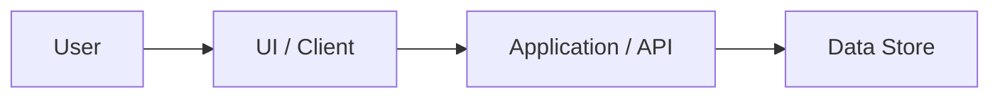

# Product Architecture

---
document_id: PROD-ARCH
title: Product Architecture
title_ko: 제품 아키텍처
project: {{PROJECT_NAME}}
profile: product
gate_scope: gate2
status: Draft
version: v0.1
owner_role: Product Architect
author: Agent
reviewer: User
approver: User
created_at: {{GENERATED_DATE}}
updated_at: {{GENERATED_DATE}}
related_documents:
  - docs/product/PRODUCT_BRIEF.md
  - docs/product/ADR_LOG.md
---

## 1. Architecture Overview

## 2. Components

| Component ID | 이름 | 책임 | 주요 계약 | 관련 Scenario |
| --- | --- | --- | --- | --- |
| CMP-001 | TBD | TBD | TBD | SCN-001 |

## 3. Runtime And Deployment Assumptions

| 항목 | 기준 |
| --- | --- |
| Runtime | TBD |
| Data Store | TBD |
| External Integration | TBD |
| Deployment Target | TBD |
| Observability | TBD |

## 4. Quality Attributes

| 품질속성 | 기준 | 검증 방법 |
| --- | --- | --- |
| Reliability | TBD | TBD |
| Security | docs/core/PRODUCT_PROFILE_BASELINE.md 기준 | TBD |
| Maintainability | TBD | TBD |

## 5. Architecture Gaps

| Gap ID | 내용 | 영향 | 후속 판단 |
| --- | --- | --- | --- |
| GAP-001 | TBD | TBD | TBD |
