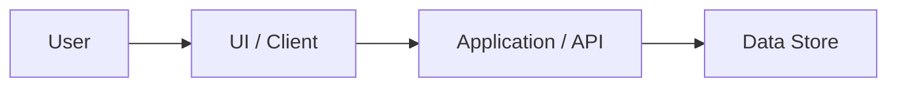

# Product Architecture

---
document_id: PROD-ARCH
title: Product Architecture
title_ko: 제품 아키텍처
project: {{PROJECT_NAME}}
profile: product
gate_scope: gate2
status: Draft
version: v0.1
owner_role: Product Architect
author: Agent
reviewer: User
approver: User
created_at: {{GENERATED_DATE}}
updated_at: {{GENERATED_DATE}}
related_documents:
  - docs/product/PRODUCT_BRIEF.md
  - docs/product/ADR_LOG.md
---

## 1. Architecture Overview

## 2. Components

| Component ID | 이름 | 책임 | 주요 계약 | 관련 Scenario |
| --- | --- | --- | --- | --- |
| CMP-001 | TBD | TBD | TBD | SCN-001 |

## 3. Runtime And Deployment Assumptions

| 항목 | 기준 |
| --- | --- |
| Runtime | TBD |
| Data Store | TBD |
| External Integration | TBD |
| Deployment Target | TBD |
| Observability | TBD |

## 4. Security Design Baseline

Product profile의 기본 보안 기준은 `docs/core/PRODUCT_PROFILE_BASELINE.md`와 `docs/core/SECURITY_BASELINE.md`를 따른다.
Audit profile처럼 KISA/SR 매핑을 기본 강제하지는 않지만, 제품 릴리즈에 영향을 주는 보안 결정을 이 표에서 명시한다.

| Security Area | 결정/정책 | 적용 위치 | 검증/증적 |
| --- | --- | --- | --- |
| Authentication | 인증 없음 / 세션 / 토큰 / 외부 IdP 중 선택 | TBD | SEC-REG-001 |
| Authorization | 단일 사용자 / 역할 기반 / 소유자 기반 접근통제 중 선택 | TBD | SEC-REG-001 |
| Input Validation | API body, query/path parameter, 화면 입력 검증 기준 | TBD | SEC-REG-001 |
| Data Protection | 개인정보/인증정보/민감정보 저장, 전송, 마스킹 기준 | TBD | SEC-REG-001 |
| Error And Logging | stack, SQL, token, 개인정보, 내부 경로 노출 금지 기준 | TBD | SEC-REG-001 |
| Web/API Risk | XSS, CSRF, CORS, SQL injection, SSRF, command injection 적용 여부 | TBD | SEC-REG-001 |
| Secrets And Config | secret/env/config 저장 위치와 배포 시 주의사항 | TBD | SEC-REG-001 |
| Dependency Risk | lockfile, known vulnerability, upgrade 판단 기준 | TBD | SEC-REG-001 |

## 5. Quality Attributes

| 품질속성 | 기준 | 검증 방법 |
| --- | --- | --- |
| Reliability | TBD | TBD |
| Security | docs/core/PRODUCT_PROFILE_BASELINE.md 기준 | TBD |
| Maintainability | TBD | TBD |

## 6. Architecture Gaps

| Gap ID | 내용 | 영향 | 후속 판단 |
| --- | --- | --- | --- |
| GAP-001 | TBD | TBD | TBD |
