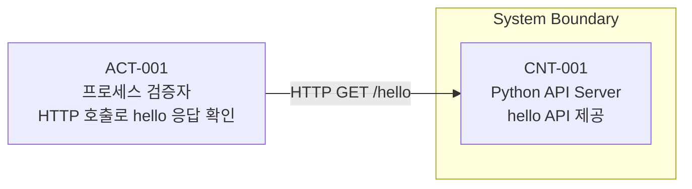
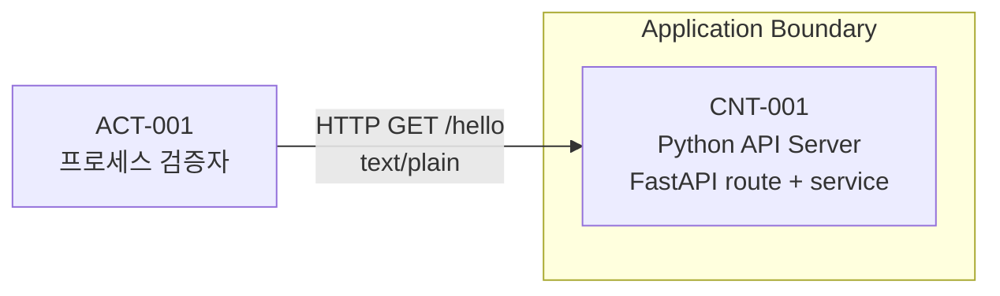
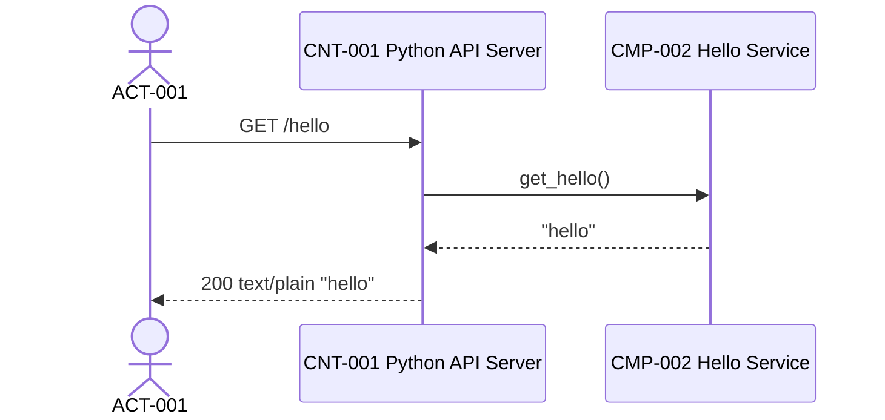

# SW 아키텍처 정의서

```yaml
---
document_id: DOC-ARCH-G2-001
title: Software Architecture Specification
title_ko: SW 아키텍처 정의서
project: regression-simple-hello
gate: G2
status: Baseline Candidate
version: v0.1
owner_role: Architecture Lead
author: Codex Orchestrator
reviewer: Orchestrator
approver: 사용자
created_at: 2026-05-24
updated_at: 2026-05-24
related_ids:
  - REQ-001
  - REQ-001-01
  - NREQ-001
  - FUNC-001
  - API-001
  - PGM-001
  - SEC-001
  - ADR-001
change_reason: Gate 2 Python hello API 설계 기준선 후보 작성
---
```

## 1. 문서 목적

본 문서는 Python hello API의 실행 단위, 컴포넌트, API 흐름, 보안 경계, 품질속성, 기술 선택 근거를 정의한다.

## 2. 아키텍처 성숙도

| 영역 | 상태 | 비고/후속 조치 |
| --- | --- | --- |
| 아키텍처 개요 | Baseline Candidate | 요구사항 범위가 단일 API로 고정됨 |
| 논리 아키텍처 | Baseline Candidate | API 서버 단일 컨테이너 |
| 물리 아키텍처 | Baseline Candidate | 로컬 개발 PC 실행 |
| 모듈/컴포넌트 구조 | Baseline Candidate | Router, Service, Config |
| 데이터 흐름 | Baseline Candidate | 저장소 없음 |
| 보안 아키텍처 | Baseline Candidate | 민감정보 미처리, 디버그/오류정보 노출 방지 |
| 품질속성 설계 | Baseline Candidate | 로컬 재현성 중심 |
| 기술 스택 및 선택 근거 | Baseline Candidate | Python/FastAPI 채택 |
| 아키텍처 결정사항 | Baseline Candidate | ADR-001 Accepted |
| 추적성 및 상세 설계 연결 | Baseline Candidate | 설계 문서와 추적표 연결 |

## 3. 아키텍처 개요

| 항목 | 내용 | 관련 ID |
| --- | --- | --- |
| 시스템 목적 | 로컬 Python 백엔드에서 hello API를 제공한다. | REQ-001 |
| 주요 사용자 | 프로세스 검증자, 개발자 | ACT-001 |
| 주요 품질속성 | 실행/검증 명령의 로컬 재현성 | NREQ-001 |
| 아키텍처 범위 | 단일 API 서버, 단일 hello API, 명령 기반 검증 | REQ-001-01 / NREQ-001 |
| 제외 범위 | 프론트엔드, DB, 인증/인가, 배포 자동화 | DEC-001 |

### 3.1 아키텍처 요약

| 항목 | 내용 |
| --- | --- |
| 아키텍처 스타일 | Monolith + Layered Router/Service |
| 주요 실행 단위 | CNT-001 Python API Server |
| 주요 품질속성 | NREQ-001 로컬 재현성 |
| 주요 보안 관심사 | SEC-001 민감정보 미처리 및 오류정보 노출 방지 |
| 주요 외부 연계 | 해당없음 |
| 주요 제약 | DB/UI/auth 제외, 단순 문자열 응답 |

## 4. 논리 아키텍처

| 논리 영역 | CNT/IF/DB-ID | 책임 | 주요 기술/방식 | 관련 REQ/NREQ/SEC |
| --- | --- | --- | --- | --- |
| 클라이언트 | ACT-001 | HTTP 요청으로 API 응답 확인 | curl, PowerShell, 테스트 클라이언트 | REQ-001-01 |
| 백엔드/API | CNT-001 / API-001 | hello API 제공, 응답 생성, 오류 처리 | Python 3 + FastAPI | REQ-001-01 / NREQ-001 / SEC-001 |
| DB | 해당없음 | 저장 데이터 없음 | 해당없음 | REQ-001-01 |
| 외부 연계 | 해당없음 | 외부 시스템 호출 없음 | 해당없음 | 해당없음 |
| 인증/권한 | 해당없음 | 공개 로컬 테스트 API | 인증 없음 | SEC-001 |
| 배치/비동기 | 해당없음 | 비동기/배치 없음 | 해당없음 | 해당없음 |

### 4.1 C1 시스템 컨텍스트

| Actor/System-ID | 이름 | 유형 | 설명 | 주요 연결 | 관련 REQ/NREQ/SEC |
| --- | --- | --- | --- | --- | --- |
| ACT-001 | 프로세스 검증자 | 사용자 | HTTP 호출로 hello 응답과 프로세스 산출물을 확인한다. | CNT-001 | REQ-001-01 / NREQ-001 |



### 4.2 C2 컨테이너 구조

| CNT-ID | 이름 | 책임 | 기술/런타임 | 배포 단위 | 데이터 저장소 | 관련 REQ/NREQ/SEC |
| --- | --- | --- | --- | --- | --- | --- |
| CNT-001 | Python API Server | hello API 엔드포인트 제공, 응답 생성, 공통 오류 처리 | Python 3.11+ / FastAPI / Uvicorn | `backend/` 로컬 실행 단위 | 해당없음 | REQ-001-01 / NREQ-001 / SEC-001 |



## 5. 물리 아키텍처

| PHY-ID | 구분 | 구성 | 환경 | 네트워크/포트 | 런타임/컨테이너 | 관련 CNT/DEP |
| --- | --- | --- | --- | --- | --- | --- |
| PHY-001 | 개발 PC | 로컬 백엔드 프로세스 | local | `127.0.0.1:8000` 후보 | Python 3.11+, Uvicorn | CNT-001 / DEP-001 |

| DEP-ID | 배포 단위 | 배포 대상 | 설정/시크릿 | 로그/모니터링 | 백업/복구 | 장애 대응 |
| --- | --- | --- | --- | --- | --- | --- |
| DEP-001 | backend app | 로컬 개발 PC | 포트는 환경변수 또는 실행 옵션으로 조정 가능, 비밀값 없음 | 콘솔 로그, 테스트 로그 | 해당없음 | 실행 실패 시 명령 로그와 exit code 기록 |

## 6. 모듈/컴포넌트 구조

| CMP-ID | CNT-ID | 컴포넌트명 | 책임 | 주요 인터페이스 | 관련 PGM/API/DB/SCR | 관련 REQ/SEC |
| --- | --- | --- | --- | --- | --- | --- |
| CMP-001 | CNT-001 | Hello Router | HTTP 요청 수신, 응답 Content-Type 지정 | API-001 | API-001 / PGM-001 | REQ-001-01 / SEC-001 |
| CMP-002 | CNT-001 | Hello Service | `hello` 응답 값을 제공하는 업무 규칙 | IF-001 | PGM-001 | REQ-001-01 |
| CMP-003 | CNT-001 | App Config | FastAPI app 생성, router 등록 | PGM-001 | PGM-001 | NREQ-001 / SEC-001 |

## 7. 데이터 흐름

| FLOW-ID | 시나리오 | 시작 주체 | 주요 단계 | 오류/예외 흐름 | 관련 REQ/AC/SEC |
| --- | --- | --- | --- | --- | --- |
| FLOW-001 | hello API 호출 | ACT-001 | ACT-001 -> CNT-001/CMP-001 -> CMP-002 -> HTTP 응답 | 서버 오류 시 내부 stack trace를 응답에 노출하지 않음 | REQ-001-01 / AC-001-01 / AC-001-02 / SEC-001 |



### 7.1 인증 흐름

| FLOW-ID | 인증/권한 흐름 | 적용 위치 | 세션/토큰/권한 기준 | 관련 SEC |
| --- | --- | --- | --- | --- |
| 해당없음 | 인증/권한 없음 | API-001 | 프로세스 검증용 공개 로컬 API | SEC-001 |

### 7.2 API 호출 흐름

| FLOW-ID | API 흐름 | 요청 | 응답 | 오류 처리 | 관련 API/PGM |
| --- | --- | --- | --- | --- | --- |
| FLOW-001 | hello API | `GET /hello` | `200 text/plain`, body `hello` | 내부 오류는 표준 오류로 변환하고 stack trace 미노출 | API-001 / PGM-001 |

## 8. 보안 아키텍처

| SEC-ID | 보안 관심사 | 아키텍처 적용 방식 | 적용 위치 | 참조 표준 | 검증 |
| --- | --- | --- | --- | --- | --- |
| SEC-001 | 민감정보 미처리 및 오류정보 노출 방지 | 요청/응답에 개인정보, 인증정보, 저장 데이터를 포함하지 않고 내부 오류 상세를 응답/로그에 과도하게 남기지 않는다. | CNT-001 / API-001 / PGM-001 | KISA-SD-2021 SR3-1 / OWASP-T10-2021 A05 / CWE-209 | Gate 3 IT/리뷰 후보 |

| 보안 영역 | 적용 기준 | 관련 SEC | 관련 상세 설계 |
| --- | --- | --- | --- |
| 인증 | 이번 범위 해당없음 | SEC-001 | 보안가이드 |
| 인가 | 이번 범위 해당없음 | SEC-001 | 보안가이드 |
| 세션/토큰 | 이번 범위 해당없음 | SEC-001 | 보안가이드 |
| 암호화 | 저장/전송 민감정보 없음 | SEC-001 | 보안가이드 |
| 로깅/감사 | 민감정보 및 내부 stack trace 응답 노출 금지 | SEC-001 / NREQ-001 | 개발표준 / 프로그램 설계서 |
| 네트워크 보안 | 로컬 개발 HTTP로 제한, 운영 배포는 범위 밖 | SEC-001 | 물리 아키텍처 |

## 9. 품질속성 설계

| QA-ID | 관련 NREQ | 품질속성 | 목표 | 아키텍처 전략 | 검증 방법 |
| --- | --- | --- | --- | --- | --- |
| QA-001 | NREQ-001 | 재현성 | 동일 문서의 명령으로 서버 실행과 API 검증이 가능해야 한다. | 단일 backend 실행 단위, 명령 표준화 | Gate 3/4 명령 기반 검증 |

| 품질속성 | 설계 기준 | 측정/검증 방법 | 관련 NREQ/PT/IT |
| --- | --- | --- | --- |
| 성능 | 별도 성능 목표 없음 | 성능테스트 해당없음 | 해당없음 |
| 확장성 | 단일 API 구조로 시작하되 Router/Service 분리 | 리뷰 | NREQ-001 |
| 가용성 | 로컬 실행 프로세스가 정상 기동해야 함 | 서버 smoke 및 API 호출 | NREQ-001 / IT 후보 |
| 장애 대응 | 실행 실패/테스트 실패는 로그와 exit code로 남김 | Gate 4 QA 로그 | NREQ-001 |
| 유지보수성 | API 경계와 service 경계를 분리 | 코드 리뷰 후보 | NREQ-001 |

## 10. 기술 스택 및 선택 근거

| 영역 | 선택 기술 | 대안 | 선택 이유 | 제외/보류 사유 | 관련 ADR |
| --- | --- | --- | --- | --- | --- |
| 언어 | Python 3.11+ | Java, Node.js | 사용자 요청이 Python 백엔드이며 최소 API 구현에 적합 | 없음 | ADR-001 |
| 프레임워크 | FastAPI | Flask, 표준 라이브러리 HTTP 서버 | 타입 힌트, TestClient, 작은 API 구현/검증 편의성 | Flask/stdlib은 계약/테스트 편의성이 상대적으로 낮음 | ADR-001 |
| DB | 해당없음 | SQLite | hello 응답은 저장 데이터가 필요 없음 | DB 범위 제외 | ADR-002 |
| 배포 방식 | 로컬 실행 | 컨테이너/클라우드 | 프로세스 검증이 목적 | 배포 자동화 범위 제외 | ADR-003 |
| 테스트 도구 | pytest + FastAPI TestClient | curl만 사용 | 자동 검증과 명령 기반 호출을 함께 남기기 쉬움 | 없음 | ADR-001 |

## 11. 데이터 및 연계 구조

| 항목 ID | 유형 | 설명 | 연결 대상 | 실패/재처리 기준 | 관련 문서 |
| --- | --- | --- | --- | --- | --- |
| 해당없음 | 데이터 저장소 | 저장 데이터 없음 | 해당없음 | 해당없음 | DB명세서 N/A |
| 해당없음 | 외부 연계 | 외부 시스템 호출 없음 | 해당없음 | 해당없음 | API정의서 |

## 12. 아키텍처 결정사항

| ADR-ID | 결정사항 | 선택안 | 대안 | 결정 사유 | 영향 범위 | 상태 |
| --- | --- | --- | --- | --- | --- | --- |
| ADR-001 | Python hello API 스택 | FastAPI + Uvicorn + pytest | Flask, stdlib HTTP server | 최소 API 구현, 자동 테스트, 타입 기반 계약에 적합 | CNT-001 / API-001 / PGM-001 / NREQ-001 | Accepted |
| ADR-002 | DB 제외 | 저장소 없음 | SQLite | hello 응답은 상태 저장이 필요 없음 | REQ-001-01 / DB명세서 | Accepted |
| ADR-003 | 배포 제외 | 로컬 실행 | Docker, cloud deploy | 현재 목표는 프로세스 검증 | NREQ-001 | Accepted |

## 13. 추적성 및 상세 설계 연결

| 아키텍처 ID | 연결 설계문서 | 연결 ID | 설명 |
| --- | --- | --- | --- |
| CNT-001 | DOC-CORE-G2-001_Function-Spec_v0.1.md | FUNC-001 | hello API 기능 설계 |
| CNT-001 | DOC-CORE-G2-002_Program-Design_v0.1.md | PGM-001 / CMP-001~003 / IF-001 / MTH-001 | 프로그램/컴포넌트 계약 |
| CNT-001 | DOC-API-G2-001_API-Spec_v0.1.md | API-001 | HTTP API 계약 |
| SEC-001 | DOC-SEC-G2-001_Security-Guide_v0.1.md | SEC-001 | 보안가이드 연결 |
| CNT-001 | DOC-DEV-G2-001_Development-Standard_v0.1.md | ADR-001 | 개발표준 연결 |
| DB N/A | DOC-DATA-G2-002_Database-Spec_v0.1.md | ADR-002 | DB 제외 결정 연결 |
| SCR N/A | DOC-CORE-G2-003_Screen-Spec_v0.1.md | API-001 | 화면 제외 결정 연결 |
| FLOW-001 | DOC-QA-G3-001_Test-Cases_v0.1.md | UT- / IT- / UI- / PT- | Gate 3 테스트 설계 연결 |
| REQ-001-01 / NREQ-001 | DOC-CORE-G4-001_Traceability-Matrix_v0.1.md | REQ-001-01 / NREQ-001 / AC-001-01 / AC-001-02 / AC-002-01 | 요구사항 추적 연결 |

## 14. Gate 2 검토 체크리스트

| 확인 항목 | 결과 | 비고 |
| --- | --- | --- |
| 아키텍처 개요에 시스템 목적, 주요 사용자, 품질속성, 범위가 작성되었는가 | 예 | 단일 hello API 범위 |
| 논리 아키텍처가 프론트엔드, 백엔드/API, DB, 연계, 인증/권한, 배치/비동기 관점으로 작성되었는가 | 예 | 제외 영역은 해당없음 사유 기록 |
| 물리 아키텍처에 서버, 네트워크, 배포 단위, 런타임, 환경이 작성되었는가 | 예 | 로컬 실행 기준 |
| C1 시스템 컨텍스트가 작성되었는가 | 예 | Mermaid 포함 |
| C2 컨테이너 구조가 작성되었는가 | 예 | Mermaid 포함 |
| C1/C2 다이어그램에 `subgraph` 경계가 표현되었는가 | 예 | System/Application Boundary |
| 파일명 나열형 다이어그램이 아니라 실행 단위와 책임 중심으로 작성되었는가 | 예 | CNT/CMP 중심 |
| C3 컴포넌트 구조가 상세 설계와 연결되었는가 | 예 | CMP-001~003 |
| 주요 처리 흐름이 `FLOW-ID`로 식별되었는가 | 예 | FLOW-001 |
| 품질속성이 `NREQ-ID`와 연결되었는가 | 예 | NREQ-001 |
| 보안 아키텍처가 `SEC-ID`와 연결되었는가 | 예 | SEC-001 |
| 기술 스택 및 선택 근거가 `ADR-ID`와 연결되었는가 | 예 | ADR-001~003 |
| 주요 기술/구조 결정이 `ADR-ID`로 기록되었는가 | 예 | Accepted |
| 상세 설계 문서와 추적표에 연결 가능한 ID가 있는가 | 예 | FUNC/API/PGM/SEC |
