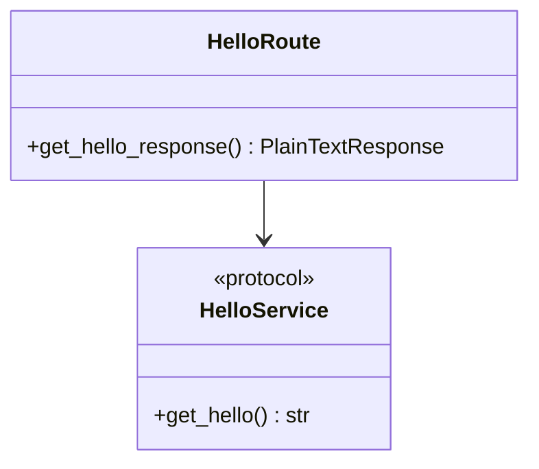

# 프로그램 설계서

```yaml
---
document_id: DOC-CORE-G2-002
title: Program Design Specification
title_ko: 프로그램 설계서
project: regression-simple-hello
gate: G2
status: Baseline Candidate
version: v0.1
owner_role: Technical Architect
author: Codex Orchestrator
reviewer: Security Reviewer
approver: 사용자
created_at: 2026-05-24
updated_at: 2026-05-24
related_ids:
  - PGM-001
  - IF-001
  - MTH-001
  - DTO-001
  - SKEL-001
  - REQ-001-01
  - FUNC-001
  - API-001
  - SEC-001
change_reason: Gate 2 hello API 프로그램 계약 작성
---
```

## 1. 문서 목적

본 문서는 `FUNC-001`을 구현 가능한 Python/FastAPI 프로그램, 컴포넌트, public method contract, skeleton 후보로 전개한다.

## 2. 프로그램/컴포넌트 목록

| PGM-ID | 프로그램/컴포넌트 | 유형 | 패키지/경로 | 관련 FUNC | 관련 API/SCR | 관련 DB | 관련 SEC | 상태 |
| --- | --- | --- | --- | --- | --- | --- | --- | --- |
| PGM-001 | Hello API Program | Route + Service | `backend/app/` | FUNC-001 | API-001 / SCR 해당없음 | 해당없음 | SEC-001 | Baseline Candidate |

## 3. 패키지 및 모듈 구조

| 영역 | 기준 패키지/경로 | 책임 | 변경 허용 기준 |
| --- | --- | --- | --- |
| App Entry | `backend/app/main.py` | FastAPI app 생성, router 등록 | CNT/API 계약 변경 시 |
| Controller / Route | `backend/app/api/hello.py` | `GET /hello` 요청 수신, `text/plain` 응답 반환 | API-001 변경 시 |
| Service / UseCase | `backend/app/services/hello_service.py` | `hello` 응답 값 제공 | FUNC-001 / PGM-001 변경 시 |
| DTO / Model | `backend/app/schemas/` | 이번 범위 해당없음 | API 응답이 JSON으로 변경될 때 |
| Tests | `backend/tests/` | service unit, API integration 검증 | Gate 3 테스트 설계 변경 시 |

## 4. Interface Contract

| Interface-ID | PGM-ID | 인터페이스명 | 패키지/경로 | 구현체 | 관련 FUNC/API/SEC | 비고 |
| --- | --- | --- | --- | --- | --- | --- |
| IF-001 | PGM-001 | HelloService | `backend/app/services/hello_service.py` | `DefaultHelloService` 또는 단일 service 함수 | FUNC-001 / API-001 / SEC-001 | public contract는 `get_hello() -> str` |

### 4.1 Python / FastAPI Contract

```python
from typing import Protocol


class HelloService(Protocol):
    """PGM-001 / IF-001: hello 응답 생성 public contract."""

    def get_hello(self) -> str:
        """REQ-001-01, AC-001-02. 단순 문자열 'hello'를 반환한다."""
```

## 5. Abstract Base Contract

| Abstract-ID | 추상 클래스/기반 컴포넌트 | 적용 대상 | protected/public 메소드 | 오버라이드 규칙 | 생략/적용 사유 |
| --- | --- | --- | --- | --- | --- |
| 해당없음 | 해당없음 | 해당없음 | 해당없음 | 해당없음 | 단일 API이며 공통 base class가 필요 없다. |

## 6. Class / Component Responsibility

### PGM-001 Hello API Program

| 항목 | 내용 |
| --- | --- |
| PGM-ID | PGM-001 |
| 이름 | Hello API Program |
| 유형 | Route + Service |
| 패키지/경로 | `backend/app/api/hello.py`, `backend/app/services/hello_service.py`, `backend/app/main.py` |
| 설명 | hello API 요청을 처리하고 단순 문자열 `hello`를 반환한다. |
| 관련 요구사항 | REQ-001-01 / NREQ-001 |
| 관련 인수기준 | AC-001-01 / AC-001-02 / AC-002-01 |
| 관련 기능 | FUNC-001 |
| 관련 화면/API | SCR 해당없음 / API-001 |
| 관련 데이터 | 해당없음 |
| 관련 보안항목 | SEC-001 |
| 주요 책임 | 라우터 등록, 요청 처리, `hello` 응답 반환, 내부 오류 상세 미노출 |
| 책임 제외 | 인증/인가, DB 접근, JSON DTO, 프론트엔드 화면, 배포 자동화 |
| 상태 동기화/복구 전략 | 해당없음 |
| 외부 호출/재시도 기준 | 해당없음 |
| 사용자 오류 표시 기준 | API 오류 시 내부 상세 정보 노출 금지 |

## 7. Public Method Contract

| Method-ID | IF-ID | PGM-ID | 시그니처/이벤트 | 입력 | 출력 | 검증/정책 | 오류/예외 | 트랜잭션 | 로그/감사 | 관련 ID |
| --- | --- | --- | --- | --- | --- | --- | --- | --- | --- | --- |
| MTH-001 | IF-001 | PGM-001 | `get_hello() -> str` | 없음 | `hello` 문자열 | 반환값은 정확히 `hello` | 일반적으로 예외 없음 | None | DEBUG 이하 선택, 민감정보 없음 | REQ-001-01 / FUNC-001 / API-001 / AC-001-02 / UT-001 후보 |
| MTH-002 | 해당없음 | PGM-001 | `GET /hello` route handler | HTTP 요청 본문 없음 | `200 text/plain` `hello` | status 200, body `hello`, content-type text/plain | 내부 오류 상세 미노출 | None | INFO 요청 로그 선택 | AC-001-01 / AC-001-02 / SEC-001 / IT-001 후보 |

## 8. DTO / Entity / Data Contract

| Contract-ID | 유형 | 이름 | 필드 | 제약/검증 | 관련 DB/API/SCR | 비고 |
| --- | --- | --- | --- | --- | --- | --- |
| DTO-001 | Response Body | HelloTextResponse | raw string | 값은 `hello` | API-001 | JSON DTO 없음 |

환경/설정 계약:

| Config-ID | 이름 | 사용 위치 | 값 출처 | 기본값 | 하드코딩 허용 여부 | 검증 방법 |
| --- | --- | --- | --- | --- | --- | --- |
| CFG-001 | Host | Uvicorn 실행 | 실행 명령 또는 기본값 | `127.0.0.1` | 개발 기본값 허용 | IT-002 후보 |
| CFG-002 | Port | Uvicorn 실행 | 실행 명령 또는 환경 | `8000` | 개발 기본값 허용 | IT-002 후보 |

## 9. Error / Exception / Message Contract

| 오류 ID | 발생 조건 | 예외/코드 | 사용자 메시지 | 로그 수준 | HTTP 상태/API 오류 | 관련 AC/SEC |
| --- | --- | --- | --- | --- | --- | --- |
| ERR-001 | 예상하지 못한 서버 오류 | INTERNAL_ERROR | 요청을 처리할 수 없습니다. | ERROR | 500 / INTERNAL_ERROR | AC-002-01 / SEC-001 |

## 10. Transaction / Security / Logging Contract

| PGM/Method | 트랜잭션 경계 | 인증/인가 | 입력 검증 | 민감정보 처리 | 로깅/감사 | 검증 테스트 |
| --- | --- | --- | --- | --- | --- | --- |
| PGM-001 / MTH-001 | None | 없음 | 입력 없음 | 민감정보 없음 | 민감정보 로그 금지 | UT-001 후보 |
| PGM-001 / MTH-002 | None | 없음 | 요청 본문/파라미터 없음 | 민감정보 없음, stack trace 응답 노출 금지 | 요청 로그 선택, 내부 오류 로그는 민감정보 제외 | IT-001 / IT-002 후보 |

## 11. Test Mapping

| 테스트 ID | 유형 | 검증 대상 | 관련 Method/PGM | 관련 AC/SEC/NREQ | 비고 |
| --- | --- | --- | --- | --- | --- |
| UT-001 후보 | Unit | `get_hello()` 반환값 | MTH-001 / PGM-001 | AC-001-02 | Gate 3에서 확정 |
| IT-001 후보 | Integration | `GET /hello` status/body/content-type | MTH-002 / PGM-001 | AC-001-01 / AC-001-02 | Gate 3에서 확정 |
| IT-002 후보 | Integration/Command | 로컬 실행과 HTTP 호출 재현성 | PGM-001 | AC-002-01 / NREQ-001 / SEC-001 | Gate 3에서 확정 |

## 12. Contract Skeleton 후보

| Skeleton-ID | 대상 PGM/IF/MTH | 파일 경로 | 생성할 public 계약 | 업무 로직 포함 여부 | 검증 smoke |
| --- | --- | --- | --- | --- | --- |
| SKEL-001 | PGM-001 / IF-001 / MTH-001~002 | `backend/app/main.py`, `backend/app/api/hello.py`, `backend/app/services/hello_service.py`, `backend/tests/test_hello.py` | FastAPI app, router, service function/class, pytest skeleton | Scaffold에서는 최소 stub만 허용, 기능 구현은 Build Wave에서 완료 | `python -m pytest backend/tests` 후보, import smoke |

## 13. 상세 SW 설계 다이어그램

| PGM-ID | 복잡도 | 상속/구현 관계 | 상태 전이 | 외부/비동기 연계 | 권장 다이어그램 | 필요 여부 | 생략 사유 |
| --- | --- | --- | --- | --- | --- | --- | --- |
| PGM-001 | Low | 없음 | 없음 | 없음 | Sequence | 필요 | API 요청 흐름은 아키텍처 FLOW-001에 작성 |



## 14. Worker Run 분할 기준

| 기준 | 규칙 |
| --- | --- |
| 1차 기준 | 단일 Build Wave로 PGM-001/API-001 구현 가능 |
| 완결성 | 서버 import, service unit, API integration test가 통과해야 함 |
| 머지 가능성 | backend skeleton과 구현은 dev 브랜치에서 통합 |
| 시간 기준 | 작지만 Orchestrator 직접 구현 대신 build worker Run 사용 |
| 분리 기준 | scaffold가 필요하면 BW-000 후 BW-001 구현 |
| 금지 | 문서에 없는 JSON 응답, DB, UI, 인증 추가 금지 |

## 15. 변경이력

| 버전 | 일자 | 변경내용 | 작성자 | 검토자 | 승인자 |
| --- | --- | --- | --- | --- | --- |
| v0.1 | 2026-05-24 | Gate 2 hello API 프로그램 계약 작성 | Codex Orchestrator | Orchestrator | 사용자 |

## 16. 검토 체크리스트

| 항목 | 확인 |
| --- | --- |
| 모든 프로그램/컴포넌트에 `PGM-ID`가 부여되었는가 | 예 |
| 프로그램이 `REQ`, `AC`, `FUNC`와 연결되었는가 | 예 |
| interface/abstract class/public method contract가 필요한 수준까지 작성되었는가 | 예 |
| public method/event signature가 입력/출력/오류 타입까지 명확한가 | 예 |
| DTO/Entity/Data contract가 API/DB/화면과 모순되지 않는가 | 예 |
| 환경별 endpoint/config 값의 하드코딩 방지 또는 허용 기준이 명시되었는가 | 예 |
| Frontend/API 연동 컴포넌트의 상태 동기화, rollback/refetch, 사용자 오류 표시 기준이 명시되었는가 | 해당없음 |
| 오류/예외/메시지/로그 기준이 보안가이드와 일치하는가 | 예 |
| 트랜잭션, 인증/인가, 입력 검증, 민감정보 처리 기준이 작성되었는가 | 예 |
| 테스트가 public method 또는 주요 정책 단위와 연결되었는가 | Gate 3 후보로 작성 |
| 신규 개발 또는 큰 고도화면 Contract Skeleton 후보가 식별되었는가 | 예 |
| Worker Run으로 나눌 수 있는 기능/계약 단위가 식별되었는가 | 예 |
