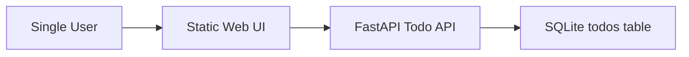

# Product Architecture

---
document_id: PROD-ARCH
title: Product Architecture
title_ko: 제품 아키텍처
project: Product TODO v0.4.8 Replay
profile: product
gate_scope: gate2
status: Draft
version: v0.1
owner_role: Product Architect
author: Agent
reviewer: User
approver: User
created_at: 2026-06-16
updated_at: 2026-06-16
related_documents:
  - docs/product/PRODUCT_BRIEF.md
  - docs/product/ADR_LOG.md
---

## 1. Architecture Overview

## 2. Components

| Component ID | 이름 | 책임 | 주요 계약 | 관련 Scenario |
| --- | --- | --- | --- | --- |
| CMP-001 | Static Web UI | 할 일 입력, 목록 표시, 완료 토글, 삭제 버튼을 제공한다. | UI-001, API-001~API-004 호출 | SCN-001, SCN-002, SCN-003 |
| CMP-002 | Todo API | TODO CRUD 요청을 검증하고 JSON 응답을 반환한다. | API-001~API-004 | SCN-001, SCN-002, SCN-003 |
| CMP-003 | Todo Store | 단일 사용자 TODO 항목을 SQLite에 저장한다. | DATA-001 | SCN-001, SCN-002, SCN-003 |

## 3. Runtime And Deployment Assumptions

| 항목 | 기준 |
| --- | --- |
| Runtime | Python 3 + FastAPI, 정적 HTML/CSS/JavaScript |
| Data Store | SQLite 단일 파일 데이터베이스 |
| External Integration | 없음 |
| Deployment Target | 로컬 개발 서버 또는 단일 프로세스 데모 환경 |
| Observability | 테스트 로그와 기본 애플리케이션 로그 |

## 4. Quality Attributes

| 품질속성 | 기준 | 검증 방법 |
| --- | --- | --- |
| Reliability | CRUD API가 정상 입력에서 일관된 상태를 유지한다. | pytest API/저장소 회귀 테스트 |
| Security | docs/core/PRODUCT_PROFILE_BASELINE.md 기준. 입력값 길이/공백 검증, 내부 오류 미노출 | API validation 테스트와 오류 응답 확인 |
| Maintainability | UI/API/저장소 책임을 분리하고 작은 파일 구조를 유지한다. | 코드 리뷰와 contract-review |

## 5. Architecture Gaps

| Gap ID | 내용 | 영향 | 후속 판단 |
| --- | --- | --- | --- |
| GAP-NONE | 현재 Gate 2 기준 차단 gap 없음 | N/A | 구현 중 계약 변경이 필요하면 새 Gap 또는 ADR로 기록 |
