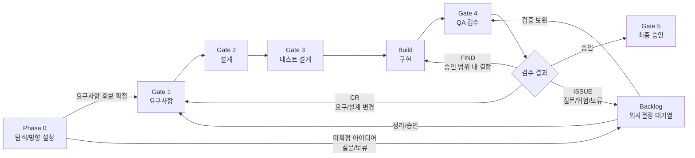

# Vulcan-Anvil Ex Process Guide

이 문서는 생성된 프로젝트 안에서 Orchestrator 에이전트와 사람이 함께 따르는 기본 진행 가이드다.

Vulcan-Anvil Ex의 핵심은 사람이 코드를 직접 나열하는 것이 아니라, 사람이 방향과 승인을 맡고 에이전트가 문서, 설계, 구현, 테스트, 증적을 Gate 단위로 이어서 만드는 것이다.

## 1. 역할

| 역할 | 책임 |
|---|---|
| 사용자 / Planner | 목표 제시, 의사결정, Gate 승인, 범위 조정 |
| Orchestrator | 현재 단계 판단, 필요한 persona 또는 subagent 배정, 산출물/검증/추적성 관리 |
| Persona / Subagent | Gate별 전문 작업 수행. 예: Think, Design, Build, Verify, Review, Document |
| 도구 / `vulcan.py` | 문서 구조 생성, 추적성 점검, Run/Backlog/Session 상태 보조 검증 |

Orchestrator는 항상 현재 Gate, 입력 문서, 산출물, 검증 기준, 미결정 항목을 확인한 뒤 다음 작업을 시작한다.

## 2. 전체 흐름

Phase 0은 무거운 절차가 아니라 “아직 무엇을 만들지 명확하지 않은 상태”에서 시작하기 위한 완충 구간이다. 충분히 작고 명확한 작업은 Phase 0을 짧게 끝내고 Gate 1로 바로 들어갈 수 있다.

## 3. Gate 기준

| 단계 | 목적 | 주요 산출물 | 다음 단계 조건 |
|---|---|---|---|
| Phase 0 | 문제, 목표, 범위, 제약 탐색 | 질문 목록, 요구사항 후보, 참고자료, 위험/가정 | Gate 1 후보 또는 Backlog 항목으로 정리 |
| Gate 1 | 요구사항 확정 | 요구사항정의서, 요구사항추적표, 인수조건 | 요구사항 ID와 인수조건이 추적 가능 |
| Gate 2 | 설계 확정 | 기능명세, 프로그램명세, 화면설계, DB명세, 보안/데이터 기준 반영 | 요구사항과 설계 요소가 연결됨 |
| Gate 3 | 테스트 설계 | 단위/기능 테스트, 통합테스트, 성능테스트 계획 | 인수조건과 테스트가 연결됨 |
| Build | 구현 | 코드, 설정, 메시지 리소스, 마이그레이션 등 | 설계와 테스트 기준을 벗어나지 않음 |
| Gate 4 | QA 검수 | 테스트 결과, 화면 증적, 결함/FIND/ISSUE/CR | Blocker/Major 결함 해결 또는 CR 승격 |
| Gate 5 | 최종 승인 | 산출물 갱신, 추적성 확인, 완료 기록 | 릴리스 또는 다음 Run으로 전환 가능 |

## 4. Backlog

Backlog는 단순 TODO가 아니다. Phase 0 아이디어, FIND, CR, ISSUE, 기술부채를 다음 Run 또는 재진입 Gate로 연결하는 의사결정 대기열이다.

| 유형 | 의미 | 기본 처리 |
|---|---|---|
| `IDEA` | Phase 0에서 나온 미확정 아이디어나 질문 | 정리 후 Gate 1 후보 |
| `FIND` | 승인된 범위 안의 결함 또는 보완점 | 현 Gate 또는 Build에서 해결 |
| `CR` | 요구사항, 설계, 보안, 데이터 기준을 바꾸는 변경 | 영향 분석 후 필요한 Gate로 재진입 |
| `ISSUE` | 즉시 결론 내기 어려운 질문, 위험, 보류 | 사용자 의사결정 후 처리 |
| `DEBT` | 기술부채 또는 운영 개선 | 우선순위에 따라 Run 생성 |

자세한 운영 규칙은 `docs/backlog/PROCESS.md`를 따른다.

## 5. FIND / CR / ISSUE 판단

| 상황 | 분류 | 처리 |
|---|---|---|
| 승인된 요구사항/설계 안에서 구현 또는 테스트가 틀림 | `FIND` | 현재 Gate 안에서 수정한다 |
| 요구사항, 설계, 화면, DB, 보안 기준이 바뀜 | `CR` | 영향 범위를 분석하고 필요한 Gate로 재진입한다 |
| 판단 근거가 부족하거나 사용자 결정이 필요함 | `ISSUE` | Backlog에 남기고 의사결정을 요청한다 |
| Gate 4에서 Blocker 또는 Major 결함 발견 | `FIND` 또는 `CR` | Backlog로 미루지 않고 현 Gate에서 해결하거나 CR로 승격한다 |

## 6. 주요 문서

| 문서 | 용도 |
|---|---|
| `docs/core/ID_SYSTEM.md` | ID 체계 |
| `docs/core/TRACEABILITY_RULES.md` | 요구사항, 설계, 테스트, 코드, 증적 연결 규칙 |
| `docs/core/CHANGE_CONTROL_PROCESS.md` | 변경요청, FIND, ISSUE, Backlog 처리 기준 |
| `docs/core/AGENT_RUN_PROTOCOL.md` | Run 단위 작업 규약 |
| `docs/core/ORCHESTRATOR_PROTOCOL.md` | Orchestrator 운영 규약 |
| `docs/backlog/BACKLOG.md` | Backlog 항목 목록 |
| `docs/backlog/PROCESS.md` | Backlog 운영 규칙 |

## 7. 기본 원칙

- 코드는 문서와 추적성 없이 먼저 만들지 않는다.
- Gate 승인은 사람이 결정한다.
- 에이전트는 현재 Gate의 입력, 산출물, 검증 기준을 먼저 확인한다.
- 화면이 있는 기능은 화면설계와 화면 증적을 함께 남긴다.
- 메시지는 가능한 한 코드 하드코딩이 아니라 메시지 리소스로 분리한다.
- 보안 기준과 데이터 표준은 설계 단계에서 먼저 반영하고 테스트에서 확인한다.
- 불확실한 항목은 숨기지 않고 `ISSUE` 또는 Backlog로 남긴다.
